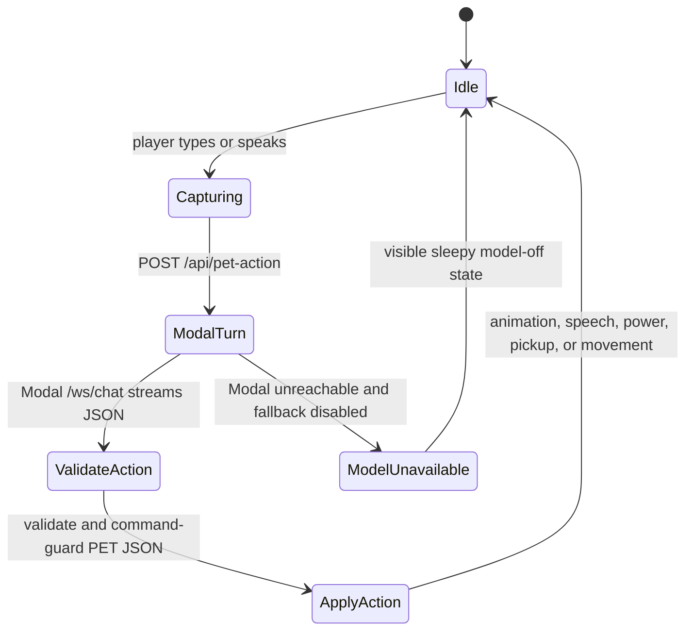
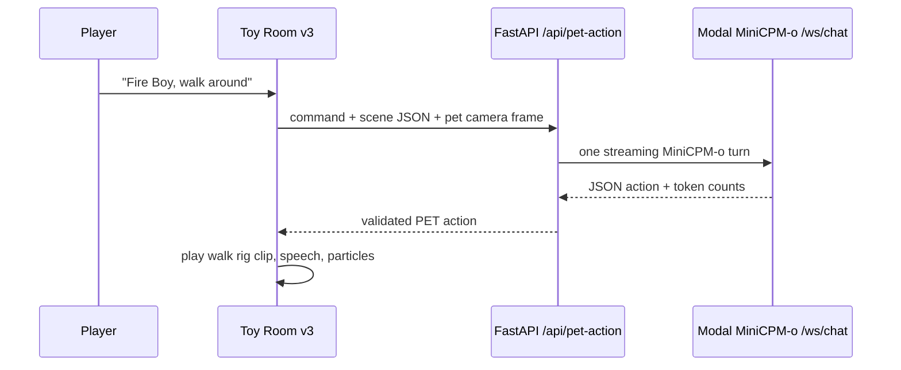

# Tiny Toybox

A Gradio-hosted Three.js virtual pet room for the Build Small Hackathon.

**Toy Room v3** is the shipped hackathon cut: one controllable Fire Boy virtual pet using the unclothed generated rig as the live body. Fire Boy can be dragged, lifted, dropped, asked to act, asked what he sees, and prompted to create or interact with room objects. The room keeps the MiniCPM/OpenBMB-compatible brain hooks, MiniCPM-V vision hook, browser speech synthesis, WebAudio effects, trace logging, and readiness evidence from v2, but focuses the demo on one character.

Local ship route:

- `http://localhost:65372/toy-v3`
- `http://localhost:65372/toy` also opens v3

**Toy Room v2** is the hackathon build: a larger shared physics room with Squeaky, Fire Boy, Shark Girl, and Electraica active at the same time. The agents have draggable/drop-able balance bodies, toggleable generated GLB rig meshes, opt-in microphone hearing, generated WebAudio sound recipes, live room/agent vision panes, generated spell operations, waste/recycling interactions, persistent JSONL memories, and MiniCPM/OpenBMB-compatible model hooks.

Hosted Space:

- v3 target: `https://build-small-hackathon-toy-room-v3.hf.space/toy-v3`
- previous v2 build: `https://build-small-hackathon-toy-room-v2.hf.space/toy-v2`
- demo video: [`demo/fire-boy-v3-demo.mp4`](demo/fire-boy-v3-demo.mp4)
- demo thumbnail: [`demo/fire-boy-v3-demo-thumbnail.png`](demo/fire-boy-v3-demo-thumbnail.png)

Key docs:

- [Toy Room v3 architecture](docs/virtual-toy-v3-architecture.md)
- [Hugging Face Spaces and submission notes](docs/hf-spaces-submission.md)
- [Prize qualification evidence](docs/prize-qualification.md)
- [Discord submission draft](docs/discord-submission-post.md)

## Toy Room v3

V3 adds:

- one Fire Boy virtual pet as the main controllable character
- the unclothed Fire Boy full-rig GLB rendered as the live body instead of a faint overlay
- brighter room and rig-viewer lighting for clearer mesh reads
- Fire Boy GLB animation clips connected to actions such as jump, throw, wave, sit, dance, and spin
- a babyish Fire Boy speech profile with higher-pitched browser voice settings
- a focused toy room with food, books, chairs, lamps, plants, balls, blocks, dominos, waste, a recycle bin, and a ramp
- commanded virtual-pet actions: ask Fire Boy to pick up/carry a box, fireball a cube, or run around the toy room
- a visible warm fireball projectile for Fire Boy's `fireball` power
- runtime loop metrics for command latency, server policy latency, approximate renderer state ops, approximate state-changing function calls, and token/sec when a model reports it
- a Fire Boy-specific judge demo for memory, vision, force input, generated objects, recycling, speech, and traces
- `/toy-v3` as the explicit v3 route, with `/toy` now pointing to the shipped v3 experience

Try these commands in `/toy-v3`:

```text
Fire Boy, pick up the box
Fire Boy, fireball the cube
Fire Boy, run around the toy room
```

## Demo Video

The repository includes a 30-second MP4 capture for the Best Demo package:

- [`demo/fire-boy-v3-demo.mp4`](demo/fire-boy-v3-demo.mp4)
- [`demo/fire-boy-v3-demo-thumbnail.png`](demo/fire-boy-v3-demo-thumbnail.png)
- Direct Space MP4: `https://huggingface.co/spaces/build-small-hackathon/toy-room-v3/resolve/main/demo/fire-boy-v3-demo.mp4`

The video shows the actual `/toy-v3` UI: Fire Boy's rig, quick action buttons, pickup, fireball, run-around behavior, baby-voice talkback, and live loop/status metrics.

Current local model status for this commit:

- Toy Room v3 uses the deployed Modal MiniCPM-o gateway as the primary action brain when `TOYBOX_MODAL_OMNI_ACTION=1` and `TOYBOX_MODAL_OMNI_URL` are set.
- `/api/model-status` reports `provider: modal`, `mode: modal-omni-websocket`, `model: openbmb/MiniCPM-o-4_5`, `authRequired: false`, and `fallbackPolicy: asleep_when_configured`.
- v3 is command-driven: page load and ambient autoplay do not call the model. One typed/spoken command or explicit quick button sends one `/api/pet-action` request, which opens one Modal `/ws/chat` turn and returns one PET state update.
- `TOYBOX_MODAL_OMNI_SEND_IMAGE=auto` sends the compact scene/object JSON on every command and only attaches the camera frame for visual commands. Startup also warms Modal `/health` in the background to reduce first-command handshake stalls.
- Action attempts are stored in SQLite at `data/pet-action-events.sqlite3` by default. Inspect `/api/pet-action-stats` and `/api/pet-action-events?limit=50` for policy, latency, token, failure, and target data.
- Verified local UI command: "Fire Boy, walk around the toy room" produced `interaction: walk`, `speech: "Me walky loop."`, `promptTokens: 1638`, `completionTokens: 9`, `tokensPerSecond: 2.35`, and `clientRoundTripMs: 3880.4`.
- Verified local API command with an agent-view image: "Fire Boy, pick up the blue box" produced `interaction: pickup`, `promptTokens: 768`, `completionTokens: 7`, `tokensPerSecond: 1.96`, and `serverLatencyMs: 3565.4`.

## Prize Qualification Map

The Build Small Hackathon prize page asks entrants to make prize usage explicit in the Space README. This entry targets:

| Track or prize | Evidence in this repo and Space |
| --- | --- |
| Thousand Token Wood | A tiny-world virtual pet where Fire Boy observes objects, reacts to commands, moves, carries toys, speaks, and fires visible powers inside a toy room. |
| Best MiniCPM Build | Toy Room v3 sends action-brain turns to `openbmb/MiniCPM-o-4_5` through the deployed Modal gateway. MiniCPM-V visual cortex and MiniCPM5 local routes remain configurable secondary paths. |
| Best Use of Modal | `modal-minicpm-omni/modal_minicpm_omni.py` deploys `openbmb/MiniCPM-o-4_5` to Modal with an L40S GPU, a Modal Volume for model cache, and a Modal Secret for Hugging Face access. Toy Room v3 calls that Modal `/ws/chat` gateway directly from `src/modal_omni_policy.py`. |
| Best Use of Codex | The GitHub repo has Codex-attributed implementation and documentation commits for v3, Fire Boy command control, MiniCPM-V helper, and submission docs. |
| Best Agent | Commands become strict PET action JSON, then execute as animations, speech, powers, particles, object pickup/carry, and physics operations. |
| Off Brand / custom UI | The user-facing app is a custom Three.js toy room inside a Gradio-compatible Space, not a default Gradio chat screen. |
| Best Demo | A short MP4 is kept at `demo/fire-boy-v3-demo.mp4` and shows pickup, fireball, run-around, speech, loop metrics, and the live toy controls. |

This entry does **not** claim the Nemotron hardware prize because no Nemotron model is currently in the runtime. It also does not claim Tiny Titan for the MiniCPM-o Modal path, because MiniCPM-o 4.5 is larger than a tiny 4B-or-under target; the smaller MiniCPM-V/MiniCPM5 routes remain documented and configurable.

## Toy Room v2

V2 adds:

- four simultaneous AI toy agents in one larger room
- active-agent power dock for one-click ability tests across Squeaky, Fire Boy, Shark Girl, and Electraica
- draggable objects and draggable agents with standing/balance physics
- active-agent force dock for lift, toss, spin, drop, and upright-settle ragdoll-style input
- force-aware rescue behavior: toss, spin, lift, or drop an agent and nearby agents visibly move in, speak, and comfort them
- toggleable generated GLB rig meshes loaded into the live room for all four agents
- waste objects, a recycle bin, food, books, chairs, lamps, plants, balls, blocks, dominos, and a ramp
- scored recycling challenge: drag recyclable waste into the bin or let Electraica sort it during the judge demo
- generic spell ops: impulse, freeze, scale, attract, particles, lights, and pet nudges
- vision-grounded decisions: "what do you see" prompts choose an action from the active agent's camera/detected-object payload
- council vision scan: the judge demo asks all four agents to inspect the room from their own agent-view cameras
- agent vision board: all four agents continuously expose their closest perceived objects and next local action affordance
- low-level motor loop: agents execute small local perception-driven moves between slower policy calls, making the AI loop feel embodied on video
- generated object recipes: prompts such as "wish for a tiny piano" can create new physical toys from simple parts
- browser speech-synthesis talkback with per-agent voice profiles plus procedural WebAudio effects
- generated sound recipes: the model can emit bounded oscillator tones for a new spell, object, or heard sound
- opt-in microphone hearing: agents receive structured sound-input summaries and can react to loud room audio
- visible learning loop: players can teach durable rules or terms, then the runtime stack shows when a remembered lesson is used
- trace-to-training export: `/api/training-dataset` summarizes valid action traces and `/api/training-dataset?format=jsonl&limit=200` emits a compact MiniCPM/PET action-policy SFT JSONL pack
- trace-retrieval fallback policy: when no live MiniCPM endpoint is configured, the backend first retrieves a similar validated action trace before falling back to hand-written heuristics
- trace-backed AI evidence: `/api/ai-evidence` summarizes distinct player inputs, generated spell ops, wishable objects, sound recipes, memories, vision-grounded actions, and policy-source counts
- partner play and reciprocal dialogue: fallback and model actions can name another agent for talk, play, share, comfort, or gather interactions, and the partner visibly answers back
- physical charades: agents receive detected stacks, lines, huddles, and wished toys from the physics scene and can guess what the player built
- one-button judge demo that teaches a rule, uses that remembered lesson, makes all four agents inspect what they see, drops an agent to trigger rescue behavior, generates an object, triggers partner play, solves a physical charade, and recycles waste through the live action loop
- live judge scorecard plus `/api/judge-status` readiness endpoint that reports hosting, assets, MiniCPM/trace-policy status, AI-load-bearing evidence, SFT traces, runtime demo proof, and remaining optional endpoint warnings
- in-room Brain Trace plus runtime stack chips for text, vision, sound, learning, trace training readiness, council scans, reciprocal dialogue, force, memory, action JSON, model status, and rig readiness
- persistent runtime memories at `data/memories/toy-room-v2.jsonl`
- action traces at `data/traces/pet-actions.jsonl`
- optional MiniCPM5 text-policy and MiniCPM-V 4.6 vision endpoints
- a Docker-backed Hugging Face Space that still serves a Gradio-mounted FastAPI app

## Run Locally

This project uses `uv` for Python dependency management. The local virtual environment is pinned to Python 3.12 via `.python-version`.

Current local setup was verified with:

- `uv 0.11.2`
- `Python 3.12.13`

```bash
./start.sh
```

`start.sh` stops previous Tiny Toybox `app.py` processes from this workspace, starts a fresh server, and prints the active URLs. Open `http://localhost:65372` for the page directory.

Useful local URLs:

- Page directory: `http://localhost:65372/pages`
- Toy Room v3: `http://localhost:65372/toy-v3`
- Toy Room v2: `http://localhost:65372/toy-v2`
- Toy room: `http://localhost:65372/toy`
- Procedural model lab: `http://localhost:65372/models`
- Blender rig previews and GLBs: `http://localhost:65372/blender-models`
- Layered part concept refs: `http://localhost:65372/parts-lab`
- Fire Boy rigged viewer: `http://localhost:65372/fireboy-rigged`

The default app port is `65372` to avoid common local preview conflicts. To choose another port for a one-off run:

```bash
PORT=65400 ./start.sh
```

To stop it:

```bash
./shutdown.sh
```

To restart everything from this project, run:

```bash
./start.sh
```

Manual uv flow:

```bash
uv sync --python 3.12
.venv/bin/python app.py
```

`start.sh` uses `uv sync` first, then runs the uv-created `.venv/bin/python` directly so `shutdown.sh` can stop the app cleanly by PID.

## Blender And SAM Character Assets

Blender is expected on PATH as `blender`. On this machine that is a wrapper in `~/.local/bin/blender` pointing at `/Applications/Blender.app/Contents/MacOS/Blender`.

Regenerate all character assets, rig previews, beauty renders, object lineups, GLBs, and the contact sheet with:

```bash
./scripts/render_blender_models.sh
```

Outputs are written to:

- `assets/generated/rigged/*.glb`
- `assets/generated/previews/*.png`

Clean raw fal/SAM GLB extractions from `potential-char-images/extracted-from-sam` with:

```bash
./scripts/clean_sam_models.sh
```

Cleaned SAM outputs are written to:

- `assets/generated/sam-cleaned/*.glb`
- `assets/generated/sam-standing-rigged/*.glb`
- `assets/generated/previews/*-sam-cleaned.png`
- `assets/generated/previews/*-sam-standing-*.png`

Layered 2D part concept outputs are written to:

- `assets/generated/part-concepts/*-parts-sheet.png`
- `assets/generated/part-concepts/individual/*/*.png` for the original sheet-derived v1 crops
- `assets/generated/part-concepts/individual-v2/*/*.png` for the cleaner individually generated v2 refs
- `assets/generated/part-concepts/*-individual-v2-contact.png`
- `assets/generated/part-concepts/parts-individual-v2-contact.png`
- `assets/generated/part-concepts/parts-manifest.json`

The v2 refs are the better input set for fal/SAM object extraction because each base body or prop is generated as one isolated image. The four base bodies are standing, while props stay separate for later Blender bone/socket attachment.

Generate fal SAM 3D Object GLBs from the four local source images with:

```bash
/Library/Frameworks/Python.framework/Versions/3.14/bin/python3 scripts/generate_sam_3d_models.py
```

That script sends images as data URLs, which avoids needing `fal files upload` permissions.

Generate fal SAM 3D Object GLBs from the v2 isolated base bodies, clothing, backpacks, and props with:

```bash
/Library/Frameworks/Python.framework/Versions/3.14/bin/python3 scripts/generate_sam_part_models.py
```

Part-level SAM outputs are written to:

- `assets/generated/part-models/raw/*/*-sam.glb`
- `assets/generated/part-models/raw/*/*-sam-result.json`
- `assets/generated/part-models/sam-part-inputs.json`

You can also run a focused pass, for example:

```bash
/Library/Frameworks/Python.framework/Versions/3.14/bin/python3 scripts/generate_sam_part_models.py --bases-only
/Library/Frameworks/Python.framework/Versions/3.14/bin/python3 scripts/generate_sam_part_models.py fire-boy-flute
```

Rig the four v2 standing base bodies and build socketed assembly test GLBs with:

```bash
./scripts/rig_part_base_models.sh
```

The rig/assembly pass writes:

- `assets/generated/part-models/rigged-bases/*-base-rigged.glb`
- `assets/generated/part-models/assemblies/*-assembled.glb`
- `assets/generated/part-models/mixamo-fbx/*-base-mesh.fbx` for Mixamo auto-rig upload tests
- `assets/generated/part-models/mixamo-fbx/*-base-rigged.fbx` for rigged FBX inspection
- `assets/generated/part-models/blend-scenes/*-assembly.blend`
- `assets/generated/previews/*-part-base-rigged.png`
- `assets/generated/previews/*-part-assembly.png`

## Optional Local Model Hook

The app can use a local OpenAI-compatible PET LLM endpoint. MiniCPM5 local mode is the recommended first text-policy brain:

```bash
scripts/start_with_minicpm5.sh
```

That script uses Ollama and `hf.co/openbmb/MiniCPM5-1B-GGUF:Q4_K_M`.

Manual PET LLM flow:

```bash
scripts/pull_minicpm5_ollama.sh
export TOYBOX_LLM_ENDPOINT=http://127.0.0.1:11434/v1/chat/completions
export TOYBOX_LLM_MODEL=hf.co/openbmb/MiniCPM5-1B-GGUF:Q4_K_M
./start.sh
```

Check the model endpoint:

```bash
uv run python scripts/check_pet_llm.py
```

## Optional Hosted Model Hook

The hosted Space can call any OpenAI-compatible chat-completions endpoint. For Hugging Face Inference Providers, set these Space variables/secrets:

```bash
hf spaces variables add build-small-hackathon/toy-room-v2 \
  -e TOYBOX_LLM_ENDPOINT=https://router.huggingface.co/v1/chat/completions \
  -e TOYBOX_LLM_MODEL=provider-backed/chat-model-id

hf spaces secrets add build-small-hackathon/toy-room-v2 \
  -s TOYBOX_LLM_API_KEY
```

Optional org billing header:

```bash
hf spaces variables add build-small-hackathon/toy-room-v2 \
  -e TOYBOX_LLM_BILL_TO=your-hf-org-or-username
```

`TOYBOX_LLM_API_KEY` may also be supplied as `HF_TOKEN` for Hugging Face endpoints, or `OPENAI_API_KEY` for OpenAI endpoints. The `/api/model-status` endpoint reports whether a hosted endpoint is active, configured but missing a secret, or falling back.

RunPod serverless endpoints are also supported when they expose an OpenAI-compatible chat-completions route:

```bash
hf spaces variables add build-small-hackathon/toy-room-v2 \
  -e TOYBOX_LLM_ENDPOINT=https://api.runpod.ai/v2/YOUR_ENDPOINT_ID/openai/v1/chat/completions \
  -e TOYBOX_LLM_MODEL=openbmb/MiniCPM5-1B-or-your-served-model-id

hf spaces secrets add build-small-hackathon/toy-room-v2 \
  -s RUNPOD_API_KEY
```

For a RunPod MiniCPM-V visual cortex, set `TOYBOX_VISION_ENDPOINT` and `TOYBOX_VISION_MODEL` to the corresponding OpenAI-compatible vision endpoint/model. The same `RUNPOD_API_KEY` secret is reused unless `TOYBOX_VISION_API_KEY` is supplied. `/api/model-status` reports `provider: runpod` and `mode: runpod-openai-compatible` for these endpoints.

If no endpoint is configured, the public build uses a deterministic heuristic fallback so the game stays playable. If an endpoint is configured but unavailable, the pet enters visible asleep/model-off mode by default. Set `TOYBOX_ALLOW_HEURISTIC_FALLBACK=1` only for local debugging when you want heuristic behavior even after a model endpoint fails.

The current OpenBMB/MiniCPM path is local-first through Ollama because the public HF router metadata did not expose provider-backed OpenBMB MiniCPM chat models during this build. The game still uses the same action JSON contract, so a hosted MiniCPM endpoint can be connected by setting `TOYBOX_LLM_ENDPOINT`, `TOYBOX_LLM_MODEL`, and a secret token.

Use Modal MiniCPM-o as the Toy Room v3 brain:

```bash
export TOYBOX_MODAL_OMNI_ACTION=1
export TOYBOX_MODAL_OMNI_URL=https://sanjuhs123--minicpm-omni-demo.modal.run
export TOYBOX_MODAL_OMNI_MODEL=openbmb/MiniCPM-o-4_5
export TOYBOX_MODAL_OMNI_SEND_IMAGE=auto
export TOYBOX_MODAL_OMNI_CONNECT_TIMEOUT=45
export TOYBOX_MODAL_OMNI_TIMEOUT=120
export TOYBOX_TRACE_POLICY=0
```

The state machine is intentionally one-turn and visible:





Check Modal remote execution and the deployed MiniCPM-o app:

```bash
uv run --with modal modal run scripts/modal_square_smoke.py
modal app list
modal app logs minicpm-omni-45
curl https://sanjuhs123--minicpm-omni-demo.modal.run/health
```

The Modal app is now the primary Toy Room v3 action loop. It uses the official MiniCPM-o 4.5 demo gateway protocol: the backend opens `/ws/chat`, sends a compact command/scene/image prompt, reads `prefill_done`, `chunk`, and `done` events, then exposes prompt tokens, completion tokens, Modal event count, latency, and tokens/sec in the Brain Trace panel.

Measure the current local runtime:

```bash
uv run python scripts/measure_runtime.py --samples 5
```

On macOS, power sampling needs sudo. If you already have a cached sudo session:

```bash
uv run python scripts/measure_runtime.py --samples 5 --power
```

MiniCPM-V 4.6 can be added as the pet's visual cortex. It reads the rendered room camera frame and returns perception plus face blendshape hints, while MiniCPM5 remains the faster action/personality model:

```bash
scripts/start_with_minicpmv46_vision.sh
```

That script uses Ollama models:

- `hf.co/openbmb/MiniCPM5-1B-GGUF:Q4_K_M` for PET-LLM actions
- `openbmb/minicpm-v4.6` for vision perception

MiniCPM-V 4.6 local vision currently needs Ollama `0.30.0` or newer. The script checks this before pulling the vision model.

Check only the vision endpoint:

```bash
TOYBOX_VISION_ENDPOINT=http://127.0.0.1:11434/api/chat \
TOYBOX_VISION_MODEL=openbmb/minicpm-v4.6 \
uv run python scripts/check_vision_endpoint.py
```

If no endpoint is configured, the app uses a deterministic fallback policy so the toy remains playable. If an endpoint is configured but cannot be used, the default behavior is visible asleep/model-off mode rather than silently pretending a heuristic is the model.

Action traces are written to `data/traces/pet-actions.jsonl` by default. These become the seed dataset for a later distilled pet-policy model.

## Code Shape

- `src/pet_policy.py` is the small orchestration layer.
- `src/modal_omni_policy.py` is the Modal MiniCPM-o WebSocket action brain for Toy Room v3.
- `src/model_policy.py` talks to text/PET-LLM endpoints.
- `src/vision_policy.py` talks to MiniCPM-V-style image endpoints.
- `src/pet_actions.py` validates actions, face blendshapes, powers, and fallback behavior.
- `objectRecipe` in pet actions is the bounded generated-content path for wishable physical toys.
- `src/pet_payload.py` owns scene compaction, target selection, and touch detection.
- `src/pet_payload.py` also detects physical arrangements so model/fallback policies can ground guesses in object positions.
- `frontend/toybox/pet.js` owns character meshes, face drawing, and blendshape interpolation.
- `frontend/toybox/pet_balance.js` owns the hidden weighted standing/balance physics rig.
- `frontend/toybox/senses.js` owns user-view, pet-view, audio, and balance feeds.
- `frontend/toybox/room.js` owns the room shell, physics objects, and history.
- `frontend/toybox/powers.js` owns executable pet powers and target selection.

See `docs/modal-1bit-model-plan.md` for the current Modal, MiniCPM-V, MiniCPM5, and 1-bit policy plan.
