# Tiny Toybox: Fire Boy MiniCPM-V VLA

<p align="center">
  <a href="https://build-small-hackathon-toy-room-v3.hf.space/toy-v3"></a>
  <a href="https://huggingface.co/build-small-hackathon/fireboy-minicpm-v-4-6-vla"></a>
  <a href="https://modal.com"></a>
  <a href="https://openai.com/codex"></a>
  <a href="LICENSE"></a>
</p>

<p align="center">
  <b>A playable AI-age virtual toy:</b> Fire Boy sees a toy room, receives natural language, routes commands through a MiniCPM-V 4.6 VLA head, then acts inside a Three.js/physics world with inspectable traces.
</p>

<p align="center">
  <a href="https://youtu.be/rwRIXLwaLmI">Watch demo</a>
  &nbsp;|&nbsp;
  <a href="https://build-small-hackathon-toy-room-v3.hf.space/toy-v3">Play Toy Room v3</a>
  &nbsp;|&nbsp;
  <a href="https://build-small-hackathon-toy-room-v3.hf.space/vla-research">Read research page</a>
  &nbsp;|&nbsp;
  <a href="https://build-small-hackathon-toy-room-v3.hf.space/frontend/research/minicpm-v46-fireboy-vla-research-paper.pdf">Open PDF</a>
  &nbsp;|&nbsp;
  <a href="https://huggingface.co/datasets/build-small-hackathon/fireboy-vla-rollout-artifacts">Dataset</a>
</p>

<p align="center">
  <a href="https://youtu.be/rwRIXLwaLmI">
    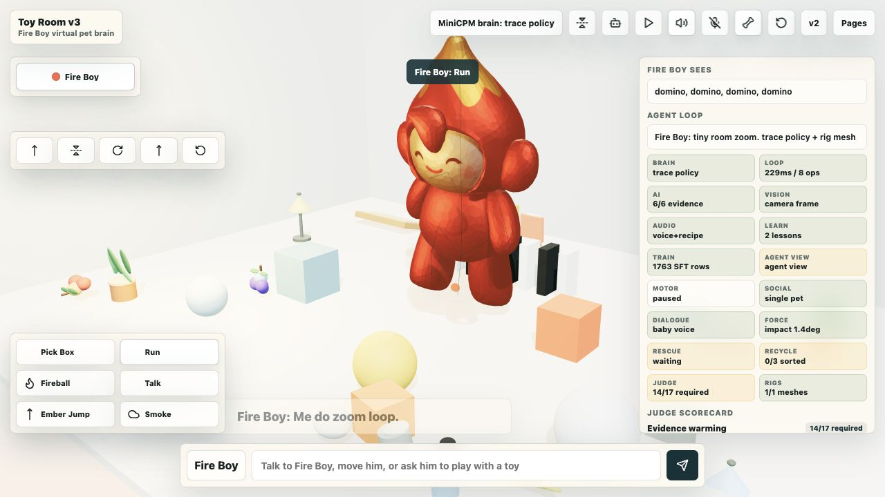
  </a>
</p>

`minicpm-v` `vision-language-action` `virtual-pet` `threejs` `mujoco` `modal` `codex` `gradio` `hackathon` `serverless-inference` `research-demo` `track:wood` `sponsor:openbmb` `sponsor:openai` `sponsor:modal`

## Creator And Submission Links

| Item | Link |
| --- | --- |
| Creator | **Sanjay Prasad H S** (`sanjuhs`) |
| GitHub repo | [sanjuhs/build-small-hackathon-v1](https://github.com/sanjuhs/build-small-hackathon-v1) |
| HF collection | [Fire Boy MiniCPM-V VLA Toy Room](https://huggingface.co/collections/sanjuhs/fire-boy-minicpm-v-vla-toy-room-6a30d607f5910fb02c0e19ef) |
| Canonical HF Space repo | [build-small-hackathon/toy-room-v3](https://huggingface.co/spaces/build-small-hackathon/toy-room-v3) |
| Canonical live Space | [https://build-small-hackathon-toy-room-v3.hf.space/toy-v3](https://build-small-hackathon-toy-room-v3.hf.space/toy-v3) |
| Personal HF Space mirror | [sanjuhs/toy-room-v3](https://huggingface.co/spaces/sanjuhs/toy-room-v3) |
| Personal live Space mirror | [https://sanjuhs-toy-room-v3.hf.space/toy-v3](https://sanjuhs-toy-room-v3.hf.space/toy-v3) |
| YouTube demo | [https://youtu.be/rwRIXLwaLmI](https://youtu.be/rwRIXLwaLmI) |
| HF model repo | [build-small-hackathon/fireboy-minicpm-v-4-6-vla](https://huggingface.co/build-small-hackathon/fireboy-minicpm-v-4-6-vla) |
| HF dataset repo | [build-small-hackathon/fireboy-vla-rollout-artifacts](https://huggingface.co/datasets/build-small-hackathon/fireboy-vla-rollout-artifacts) |

## What This Is

Tiny Toybox is a Build Small Hackathon project about making a small virtual creature feel less like a chatbot and more like a toy that lives in a room. The inspiration is a mix of Tamagotchi, Talking Tom, Pokemon-style companion play, and the dream of tiny embodied agents that can observe, decide, remember, and form habits over time.

The shipped demo focuses on **Fire Boy**, a small rigged character in **Toy Room v3**. You can drag him, pet/touch him, drop toys into the scene, ask him to pick up a ball, run around, or find and eat a berry. The point of the demo is visible causality: model call, action contract, physics result, retargeted animation, and training evidence are all inspectable.

This repo is also a research artifact for the question: **how do we turn a compact vision-language model such as MiniCPM-V 4.6 into a vision-language-action controller for a virtual pet?**

## Demo Links

| Artifact | Link |
| --- | --- |
| Playable HF Space | [Toy Room v3](https://build-small-hackathon-toy-room-v3.hf.space/toy-v3) |
| Page directory | [All demo pages](https://build-small-hackathon-toy-room-v3.hf.space/pages) |
| Research page | [MiniCPM-V 4.6 VLA paper page](https://build-small-hackathon-toy-room-v3.hf.space/vla-research) |
| Research PDF | [Open PDF](https://build-small-hackathon-toy-room-v3.hf.space/frontend/research/minicpm-v46-fireboy-vla-research-paper.pdf) |
| Policy evidence | [Policy gallery](https://build-small-hackathon-toy-room-v3.hf.space/fireboy-policy-gallery) |
| YouTube demo | [Watch on YouTube](https://youtu.be/rwRIXLwaLmI) |
| HF collection | [Fire Boy MiniCPM-V VLA Toy Room](https://huggingface.co/collections/sanjuhs/fire-boy-minicpm-v-vla-toy-room-6a30d607f5910fb02c0e19ef) |
| HF model repo | [fireboy-minicpm-v-4-6-vla](https://huggingface.co/build-small-hackathon/fireboy-minicpm-v-4-6-vla) |
| HF dataset repo | [fireboy-vla-rollout-artifacts](https://huggingface.co/datasets/build-small-hackathon/fireboy-vla-rollout-artifacts) |
| Previous build | [Toy Room v2](https://build-small-hackathon-toy-room-v2.hf.space/toy-v2) |

## Screenshots

<table>
  <tr>
    <td width="50%">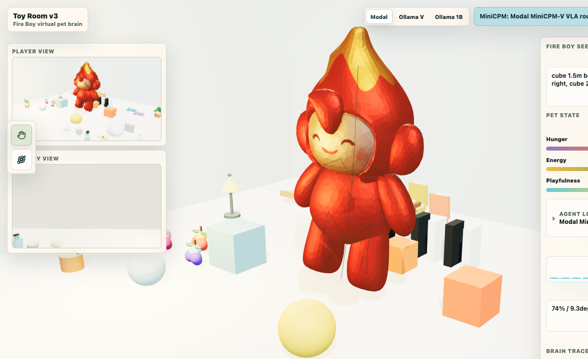</td>
    <td width="50%">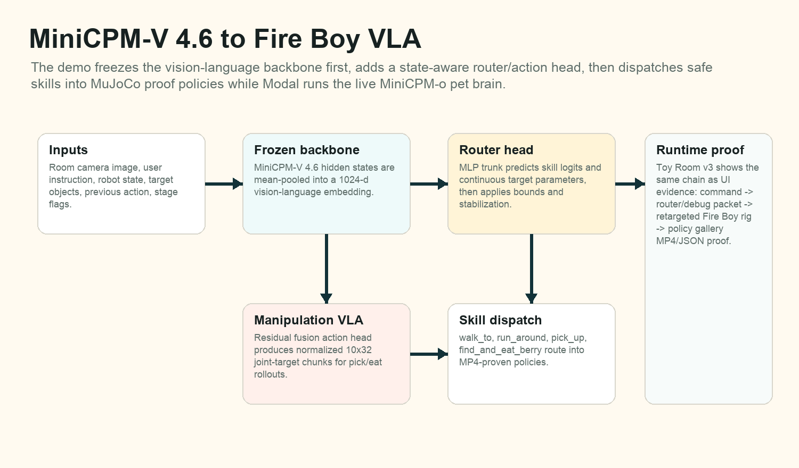</td>
  </tr>
  <tr>
    <td><b>Toy Room v3</b><br>Fire Boy is controlled through typed or spoken commands, drag/pet input, physics objects, speech, particles, and policy traces.</td>
    <td><b>MiniCPM-V to VLA</b><br>A frozen MiniCPM-V backbone feeds a router/action head, then dispatches bounded skills into proof-backed controllers.</td>
  </tr>
  <tr>
    <td>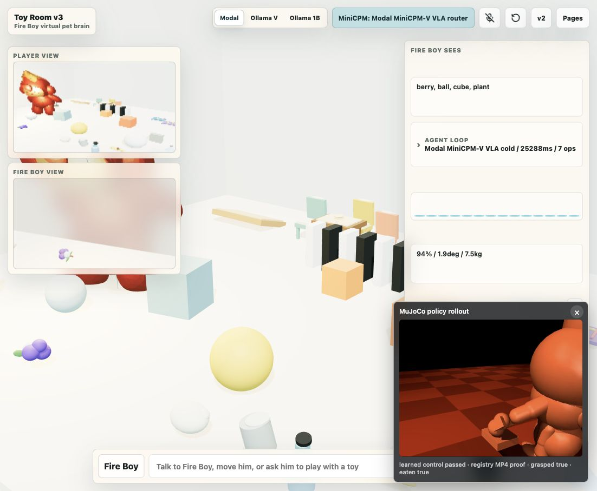</td>
    <td>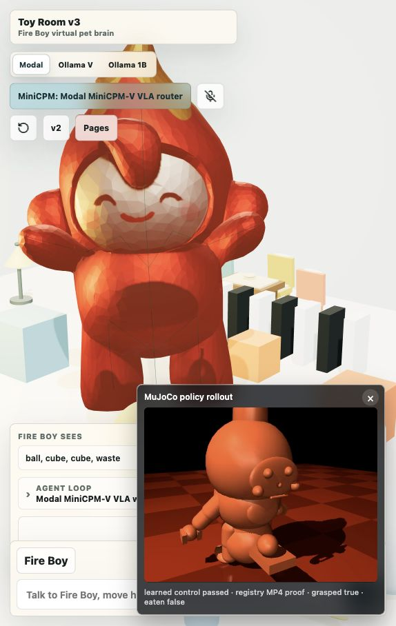</td>
  </tr>
  <tr>
    <td><b>VLA berry action</b><br>The command maps to <code>find_and_eat_berry</code>, then the toy-room runtime retargets the result into visible movement.</td>
    <td><b>VLA pickup action</b><br>The router predicts the skill and target parameters, then Toy Room v3 performs the embodied result.</td>
  </tr>
</table>

## From MiniCPM-V 4.6 To A VLA

The core idea is deliberately small: keep MiniCPM-V 4.6 as the visual-language backbone, freeze it first, and add a compact action layer that learns to choose skills and parameters from room observations.

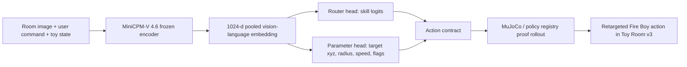

The active embodied VLA route uses:

- **Backbone:** `openbmb/MiniCPM-V-4.6`.
- **Frozen embedding:** mean-pooled 1024-dimensional vision-language features.
- **Router skills:** `walk_to`, `run_around`, `pick_up`, `find_and_eat_berry`.
- **Continuous outputs:** target position, radius, speed hints, and object flags.
- **Policy proof:** MuJoCo and retargeting artifacts stored in the model/dataset repos.
- **Runtime:** Modal-hosted MiniCPM-V router first, with MiniCPM-o 4.5 as a separate general PET/chat fallback lane.

This is not the only way to build a VLA. A stronger future version could train LoRA adapters through the vision-language trunk, fine-tune an omni model end to end, distill a fast local student policy, or use reinforcement learning over longer rollouts. This hackathon version keeps the system inspectable: frozen model, small action head, explicit action contract, visible physics result.

## Modeling Pipeline

<table>
  <tr>
    <td width="33%">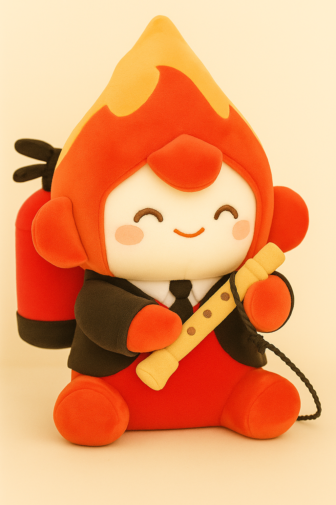</td>
    <td width="33%">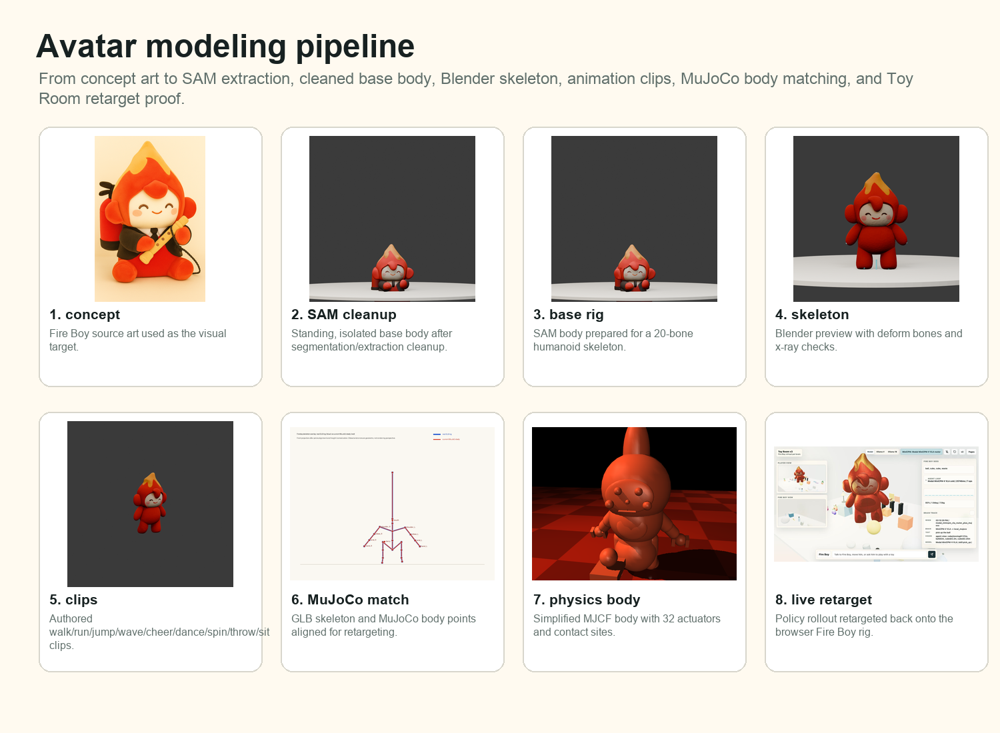</td>
    <td width="33%">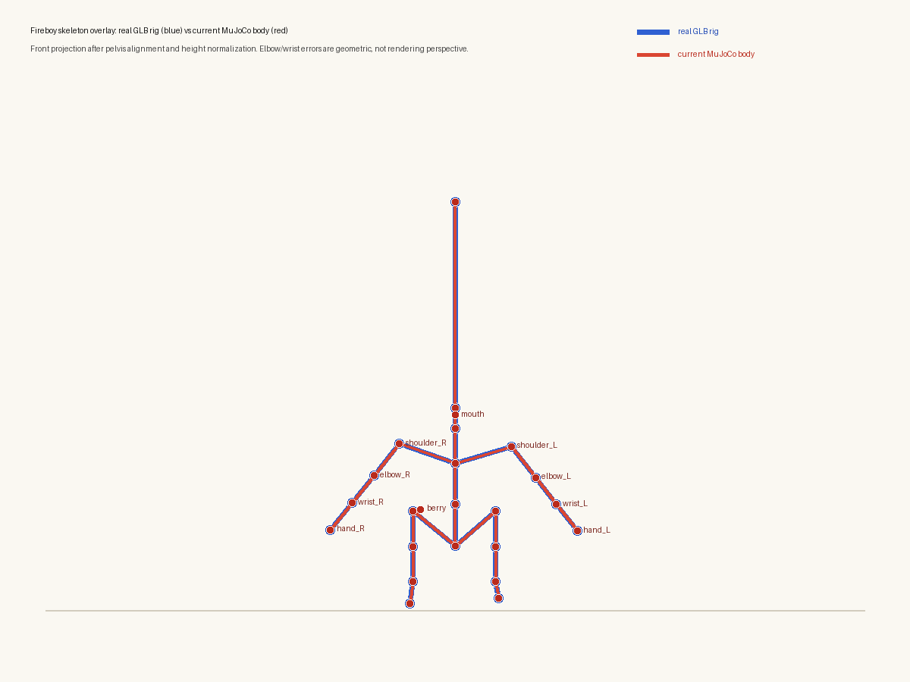</td>
  </tr>
  <tr>
    <td><b>1. Character concept</b><br>Fire Boy started as generated character art and part references.</td>
    <td><b>2. SAM and rigging</b><br>Image parts were converted to 3D assets, cleaned, rigged, and prepared as GLB bodies.</td>
    <td><b>3. Physics alignment</b><br>The visual rig was aligned with MuJoCo-style skeleton and policy rollout artifacts.</td>
  </tr>
</table>

## Character Cast

<table>
  <tr>
    <td width="25%"></td>
    <td width="25%">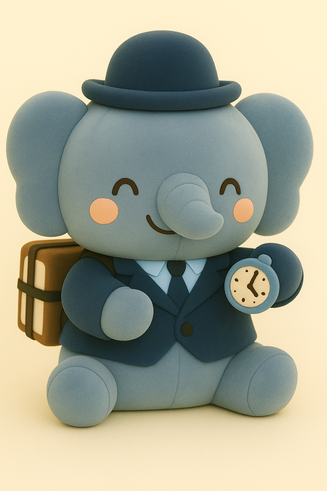</td>
    <td width="25%">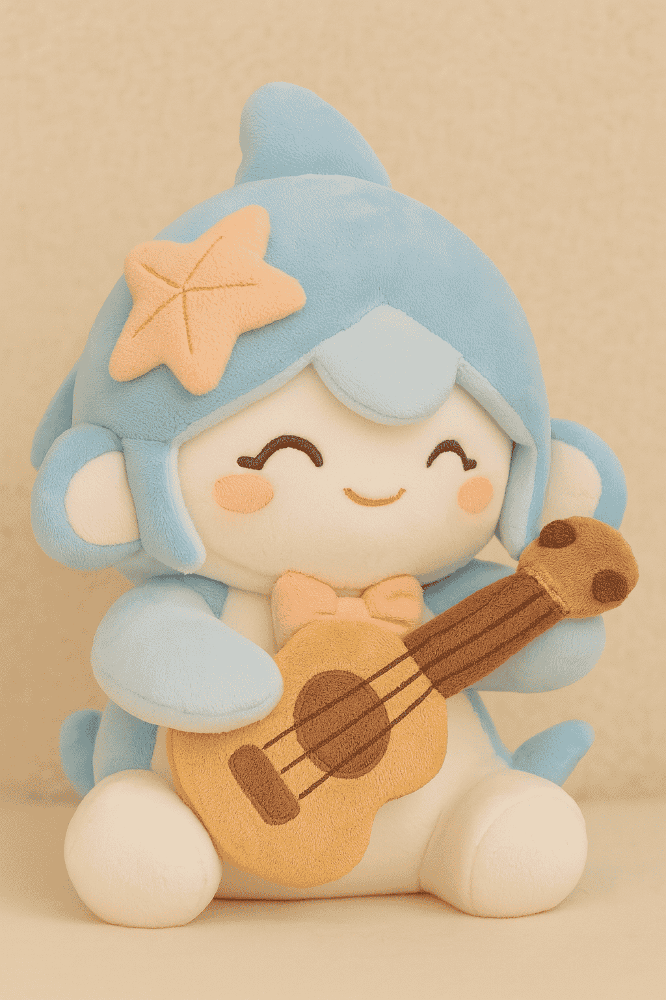</td>
    <td width="25%">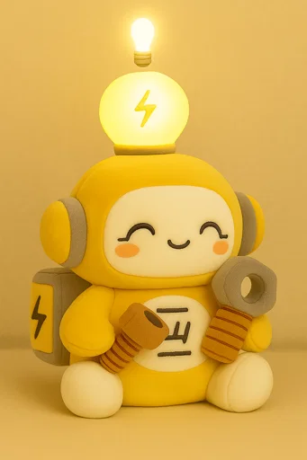</td>
  </tr>
  <tr>
    <td><b>Fire Boy</b><br>Shipped v3 pet and VLA policy target.</td>
    <td><b>Squeaky</b><br>V2 multi-agent room character.</td>
    <td><b>Shark Girl</b><br>V2 multi-agent room character.</td>
    <td><b>Electraica</b><br>V2 multi-agent room character.</td>
  </tr>
</table>

## Training Evidence

<table>
  <tr>
    <td width="50%">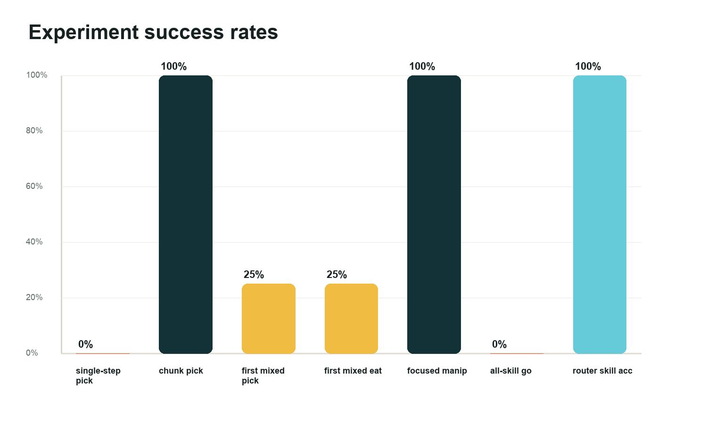</td>
    <td width="50%">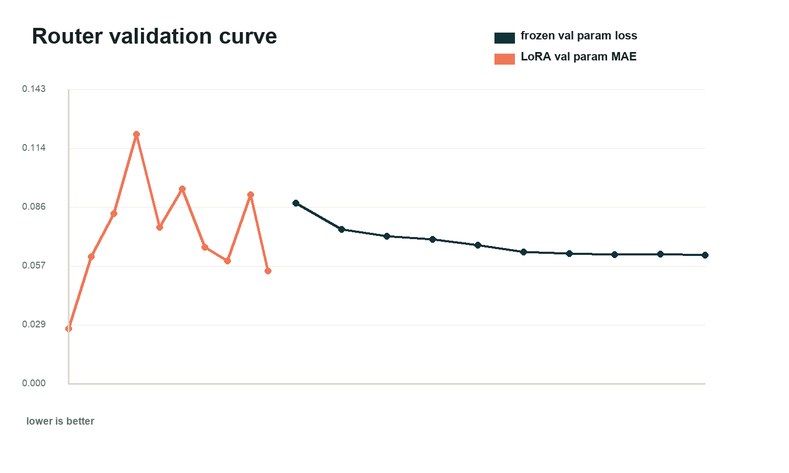</td>
  </tr>
  <tr>
    <td><b>Experiment progression</b><br>Single-step manipulation failed first; chunked skills and the router/policy registry made pick-up and berry eating reliable.</td>
    <td><b>Router training</b><br>The research page tracks validation loss and parameter error across frozen-router and LoRA experiments.</td>
  </tr>
  <tr>
    <td>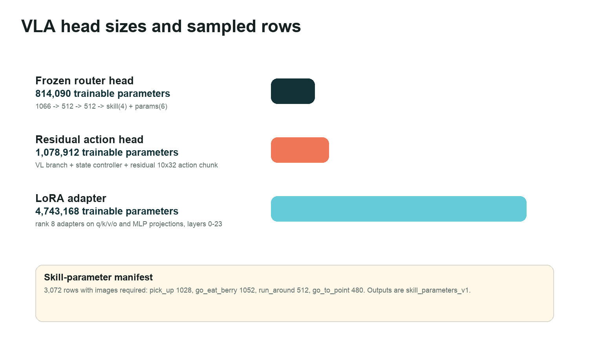</td>
    <td>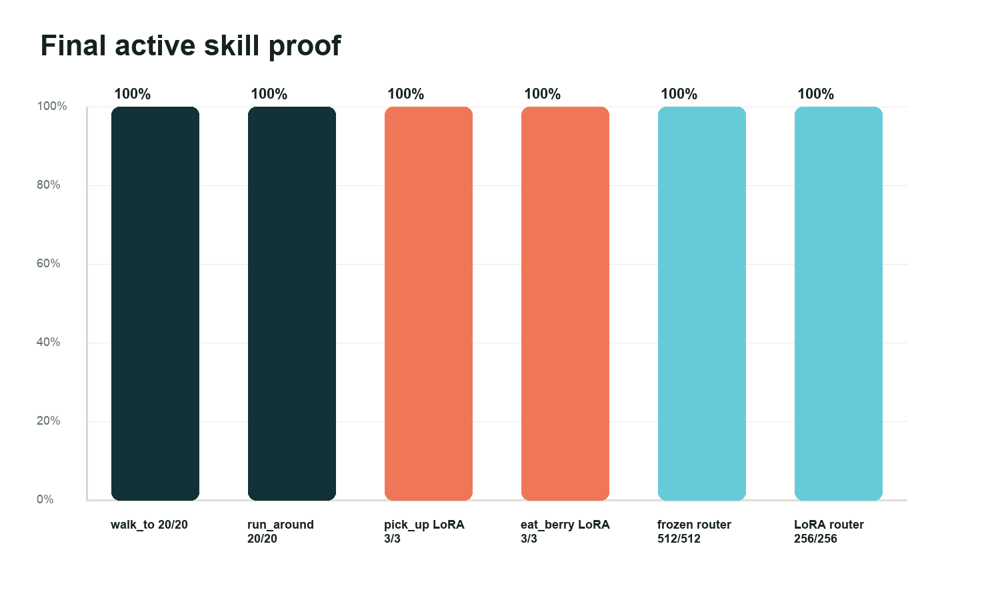</td>
  </tr>
  <tr>
    <td><b>Small action head</b><br>The demo separates the MiniCPM-V backbone from the compact trainable router/action heads.</td>
    <td><b>Final skill set</b><br>The active runtime route exposes a bounded set of embodied skills instead of unrestricted text actions.</td>
  </tr>
</table>

## Hackathon Prize Map

| Track or prize | Why this repo qualifies |
| --- | --- |
| MiniCPM | The embodied route is built around `openbmb/MiniCPM-V-4.6`, with MiniCPM-o 4.5 as a separate fallback PET lane. |
| OpenAI Codex | Codex was used throughout the build: UI scaffolding, routing, docs, evidence pages, runbooks, debugging, and commit-sized fixes. |
| Modal | Modal hosts the serverless MiniCPM-V VLA router and MiniCPM-o fallback gateway with warmup/timeout settings for demo reliability. |
| Thousand Token Wood | The project is a small virtual toy world where a tiny embodied pet observes, reacts, speaks, moves, and uses physics. |
| Best Demo | The Space includes a playable page, research page, policy gallery, PDF, screenshots, video, model repo, and dataset repo. |

## Repository Map

| Path | Purpose |
| --- | --- |
| `app.py` | FastAPI plus Gradio mount, static routes, API endpoints, and demo pages. |
| `frontend/toybox/` | Three.js Toy Room v3 runtime: room, senses, physics bodies, powers, pet controls. |
| `src/vla_router_policy.py` | MiniCPM-V 4.6 VLA-first route for embodied actions. |
| `src/modal_omni_policy.py` | Modal MiniCPM-o fallback/general PET action route. |
| `fireboy-vla-physics/` | Modal router, policy registry, training scripts, and MuJoCo-side artifacts. |
| `Fireboy-training-policy-vla/` | Proof screenshots, rollout videos, runpod notes, and VLA experiment evidence. |
| `frontend/research/` | Research diagrams and the PDF paper served by the Space. |
| `hub/` | Local model-card and dataset-card sources for the public HF repos. |

## Quick Start

Run the local app:

```bash
./start.sh
```

Then open:

- Page directory: `http://localhost:65372/pages`
- Shipped demo: `http://localhost:65372/toy-v3`
- Research page: `http://localhost:65372/vla-research`
- Policy gallery: `http://localhost:65372/fireboy-policy-gallery`

The public Space uses environment variables for real Modal endpoints. The checked-in `.env.example` intentionally contains placeholders, not private or owner-specific URLs.

## Key Docs

- [Toy Room v3 architecture](docs/virtual-toy-v3-architecture.md)
- [Hugging Face Spaces and submission notes](docs/hf-spaces-submission.md)
- [Prize qualification evidence](docs/prize-qualification.md)
- [HF blog draft](docs/hf-blog-draft.md)
- [Discord submission draft](docs/discord-submission-post.md)

## Toy Room v3

V3 adds:

- one Fire Boy virtual pet as the main controllable character
- the unclothed Fire Boy full-rig GLB rendered as the live body instead of a faint overlay
- brighter room and rig-viewer lighting for clearer mesh reads
- Fire Boy GLB animation clips connected to actions such as jump, throw, wave, sit, dance, and spin
- a babyish Fire Boy speech profile with higher-pitched browser voice settings
- a focused toy room with food, books, chairs, lamps, plants, balls, blocks, dominos, waste, a recycle bin, and a ramp
- commanded virtual-pet actions: ask Fire Boy to pick up/carry a box, fireball a cube, or run around the toy room
- a visible warm fireball projectile for Fire Boy's `fireball` power
- runtime loop metrics for command latency, server policy latency, approximate renderer state ops, approximate state-changing function calls, and token/sec when a model reports it
- a Fire Boy-specific judge demo for memory, vision, force input, generated objects, recycling, speech, and traces
- `/toy-v3` as the explicit v3 route, with `/toy` now pointing to the shipped v3 experience

Try these commands in `/toy-v3`:

```text
Fire Boy, pick up the box
Fire Boy, fireball the cube
Fire Boy, run around the toy room
```

## Demo Video

The repository includes a 30-second MP4 capture for the Best Demo package:

- [`demo/fire-boy-v3-demo.mp4`](demo/fire-boy-v3-demo.mp4)
- [`demo/fire-boy-v3-demo-thumbnail.png`](demo/fire-boy-v3-demo-thumbnail.png)
- Direct Space MP4: `https://huggingface.co/spaces/build-small-hackathon/toy-room-v3/resolve/main/demo/fire-boy-v3-demo.mp4`

The video shows the actual `/toy-v3` UI: Fire Boy's rig, quick action buttons, pickup, fireball, run-around behavior, baby-voice talkback, and live loop/status metrics.

Current local model status for this commit:

- Model split, stated plainly: Toy Room v3 has **two Modal model lanes**. The embodied VLA lane is `openbmb/MiniCPM-V-4.6` in `fireboy-vla-router`; it freezes MiniCPM-V, mean-pools 1024-d vision-language features, predicts a skill plus target parameters, and dispatches into the proof-backed MuJoCo/retargeting policy registry. The expressive PET/chat lane is `openbmb/MiniCPM-o-4_5` in `minicpm-omni-45`; it handles general PET action JSON through the official `/ws/chat` gateway.
- `/api/pet-action` intentionally tries the VLA lane first: `run_vla_router_pet_action(payload) or run_mujoco_pet_action(payload) or choose_pet_action(payload)`. When `TOYBOX_VLA_ROUTER_URL` and `TOYBOX_VLA_ROUTER_ACTION=1` are set, commands such as berry eating, pickup, run-around, and go-to are routed through the MiniCPM-V 4.6 VLA router before the MiniCPM-o fallback brain.
- The VLA router maps open commands to four executable skills: `walk_to`, `run_around`, `pick_up`, and `find_and_eat_berry`. It returns parameters such as `target_x`, `target_y`, `target_z`, `radius`, `speed_hint`, and `object_is_berry`, then Toy Room v3 retargets the result into visible Fire Boy movement, pickup, and berry eating.
- The public Space also keeps local MiniCPM-V 4.6 routes configurable: local Ollama `minicpm-v4.6` for the `Ollama V` button, and the hosted Modal VLA router for the live MiniCPM-V 4.6 skill route.
- `TOYBOX_MODAL_OMNI_SEND_IMAGE=auto` sends compact scene/object JSON on every MiniCPM-o fallback command and only attaches the camera frame for visual commands. Both deployed Modal workers use a 180-second scale-down window, and the Space uses 180-second connect/warmup/action timeouts so cold starts have room to finish.
- Action attempts are stored in SQLite at `data/pet-action-events.sqlite3` by default. Inspect `/api/pet-action-stats` and `/api/pet-action-events?limit=50` for policy, latency, token, failure, and target data.
- Verified local UI command: "Fire Boy, walk around the toy room" produced `interaction: walk`, `speech: "Me walky loop."`, `promptTokens: 1638`, `completionTokens: 9`, `tokensPerSecond: 2.35`, and `clientRoundTripMs: 3880.4`.
- Verified local API command with an agent-view image: "Fire Boy, pick up the blue box" produced `interaction: pickup`, `promptTokens: 768`, `completionTokens: 7`, `tokensPerSecond: 1.96`, and `serverLatencyMs: 3565.4`.

## Prize Qualification Map

The Build Small Hackathon prize page asks entrants to make prize usage explicit in the Space README. This entry targets:

| Track or prize | Evidence in this repo and Space |
| --- | --- |
| Thousand Token Wood | A tiny-world virtual pet where Fire Boy observes objects, reacts to commands, moves, carries toys, speaks, and fires visible powers inside a toy room. |
| Best MiniCPM Build | Toy Room v3 uses `openbmb/MiniCPM-V-4.6` through the deployed `fireboy-vla-router` Modal app for the embodied VLA skill route: walk/run, pick up, and find/eat berry. `openbmb/MiniCPM-o-4_5` remains the Modal PET/chat fallback lane for general action JSON. MiniCPM5 local routes remain configurable secondary paths. |
| Best Use of Modal | Two Modal L40S apps are deployed: `fireboy-vla-router` for the MiniCPM-V 4.6 VLA router and `minicpm-omni-45` for the MiniCPM-o fallback gateway. Both use cached model storage and a 180-second scale-down window for judge-facing reliability. |
| Best Use of Codex | The connected GitHub repo has Codex-attributed commits by `Codex <codex@openai.com>` for v3, Fire Boy command control, MiniCPM-V action-brain wiring, Modal MiniCPM routing, grounding fixes, screenshots, and submission docs. The `/vla-research` page and PDF also describe how OpenAI Codex was used holistically throughout the build. |
| Best Agent | Commands become strict PET action JSON, then execute as animations, speech, powers, particles, object pickup/carry, and physics operations. |
| Off Brand / custom UI | The user-facing app is a custom Three.js toy room inside a Gradio-compatible Space, not a default Gradio chat screen. |
| Best Demo | A short MP4 is kept at `demo/fire-boy-v3-demo.mp4` and shows pickup, fireball, run-around, speech, loop metrics, and the live toy controls. `/fireboy-policy-gallery` and `/vla-research` provide deeper demo evidence. |

This entry does **not** claim the Nemotron hardware prize because no Nemotron model is currently in the runtime. It also does not claim Tiny Titan for the MiniCPM-o Modal path, because MiniCPM-o 4.5 is larger than a tiny 4B-or-under target; the smaller MiniCPM-V/MiniCPM5 routes remain documented and configurable.

## Toy Room v2

V2 adds:

- four simultaneous AI toy agents in one larger room
- active-agent power dock for one-click ability tests across Squeaky, Fire Boy, Shark Girl, and Electraica
- draggable objects and draggable agents with standing/balance physics
- active-agent force dock for lift, toss, spin, drop, and upright-settle ragdoll-style input
- force-aware rescue behavior: toss, spin, lift, or drop an agent and nearby agents visibly move in, speak, and comfort them
- toggleable generated GLB rig meshes loaded into the live room for all four agents
- waste objects, a recycle bin, food, books, chairs, lamps, plants, balls, blocks, dominos, and a ramp
- scored recycling challenge: drag recyclable waste into the bin or let Electraica sort it during the judge demo
- generic spell ops: impulse, freeze, scale, attract, particles, lights, and pet nudges
- vision-grounded decisions: "what do you see" prompts choose an action from the active agent's camera/detected-object payload
- council vision scan: the judge demo asks all four agents to inspect the room from their own agent-view cameras
- agent vision board: all four agents continuously expose their closest perceived objects and next local action affordance
- low-level motor loop: agents execute small local perception-driven moves between slower policy calls, making the AI loop feel embodied on video
- generated object recipes: prompts such as "wish for a tiny piano" can create new physical toys from simple parts
- browser speech-synthesis talkback with per-agent voice profiles plus procedural WebAudio effects
- generated sound recipes: the model can emit bounded oscillator tones for a new spell, object, or heard sound
- opt-in microphone hearing: agents receive structured sound-input summaries and can react to loud room audio
- visible learning loop: players can teach durable rules or terms, then the runtime stack shows when a remembered lesson is used
- trace-to-training export: `/api/training-dataset` summarizes valid action traces and `/api/training-dataset?format=jsonl&limit=200` emits a compact MiniCPM/PET action-policy SFT JSONL pack
- trace-retrieval fallback policy: when no live MiniCPM endpoint is configured, the backend first retrieves a similar validated action trace before falling back to hand-written heuristics
- trace-backed AI evidence: `/api/ai-evidence` summarizes distinct player inputs, generated spell ops, wishable objects, sound recipes, memories, vision-grounded actions, and policy-source counts
- partner play and reciprocal dialogue: fallback and model actions can name another agent for talk, play, share, comfort, or gather interactions, and the partner visibly answers back
- physical charades: agents receive detected stacks, lines, huddles, and wished toys from the physics scene and can guess what the player built
- one-button judge demo that teaches a rule, uses that remembered lesson, makes all four agents inspect what they see, drops an agent to trigger rescue behavior, generates an object, triggers partner play, solves a physical charade, and recycles waste through the live action loop
- live judge scorecard plus `/api/judge-status` readiness endpoint that reports hosting, assets, MiniCPM/trace-policy status, AI-load-bearing evidence, SFT traces, runtime demo proof, and remaining optional endpoint warnings
- in-room Brain Trace plus runtime stack chips for text, vision, sound, learning, trace training readiness, council scans, reciprocal dialogue, force, memory, action JSON, model status, and rig readiness
- persistent runtime memories at `data/memories/toy-room-v2.jsonl`
- action traces at `data/traces/pet-actions.jsonl`
- optional MiniCPM5 text-policy and MiniCPM-V 4.6 vision endpoints
- a Docker-backed Hugging Face Space that still serves a Gradio-mounted FastAPI app

## Run Locally

This project uses `uv` for Python dependency management. The local virtual environment is pinned to Python 3.12 via `.python-version`.

Current local setup was verified with:

- `uv 0.11.2`
- `Python 3.12.13`

```bash
./start.sh
```

`start.sh` stops previous Tiny Toybox `app.py` processes from this workspace, starts a fresh server, and prints the active URLs. Open `http://localhost:65372` for the page directory.

Useful local URLs:

- Page directory: `http://localhost:65372/pages`
- Toy Room v3: `http://localhost:65372/toy-v3`
- Toy Room v2: `http://localhost:65372/toy-v2`
- Toy room: `http://localhost:65372/toy`
- Procedural model lab: `http://localhost:65372/models`
- Blender rig previews and GLBs: `http://localhost:65372/blender-models`
- Layered part concept refs: `http://localhost:65372/parts-lab`
- Fire Boy rigged viewer: `http://localhost:65372/fireboy-rigged`

The default app port is `65372` to avoid common local preview conflicts. To choose another port for a one-off run:

```bash
PORT=65400 ./start.sh
```

To stop it:

```bash
./shutdown.sh
```

To restart everything from this project, run:

```bash
./start.sh
```

Manual uv flow:

```bash
uv sync --python 3.12
.venv/bin/python app.py
```

`start.sh` uses `uv sync` first, then runs the uv-created `.venv/bin/python` directly so `shutdown.sh` can stop the app cleanly by PID.

## Blender And SAM Character Assets

Blender is expected on PATH as `blender`. On this machine that is a wrapper in `~/.local/bin/blender` pointing at `/Applications/Blender.app/Contents/MacOS/Blender`.

Regenerate all character assets, rig previews, beauty renders, object lineups, GLBs, and the contact sheet with:

```bash
./scripts/render_blender_models.sh
```

Outputs are written to:

- `assets/generated/rigged/*.glb`
- `assets/generated/previews/*.png`

Clean raw fal/SAM GLB extractions from `potential-char-images/extracted-from-sam` with:

```bash
./scripts/clean_sam_models.sh
```

Cleaned SAM outputs are written to:

- `assets/generated/sam-cleaned/*.glb`
- `assets/generated/sam-standing-rigged/*.glb`
- `assets/generated/previews/*-sam-cleaned.png`
- `assets/generated/previews/*-sam-standing-*.png`

Layered 2D part concept outputs are written to:

- `assets/generated/part-concepts/*-parts-sheet.png`
- `assets/generated/part-concepts/individual/*/*.png` for the original sheet-derived v1 crops
- `assets/generated/part-concepts/individual-v2/*/*.png` for the cleaner individually generated v2 refs
- `assets/generated/part-concepts/*-individual-v2-contact.png`
- `assets/generated/part-concepts/parts-individual-v2-contact.png`
- `assets/generated/part-concepts/parts-manifest.json`

The v2 refs are the better input set for fal/SAM object extraction because each base body or prop is generated as one isolated image. The four base bodies are standing, while props stay separate for later Blender bone/socket attachment.

Generate fal SAM 3D Object GLBs from the four local source images with:

```bash
/Library/Frameworks/Python.framework/Versions/3.14/bin/python3 scripts/generate_sam_3d_models.py
```

That script sends images as data URLs, which avoids needing `fal files upload` permissions.

Generate fal SAM 3D Object GLBs from the v2 isolated base bodies, clothing, backpacks, and props with:

```bash
/Library/Frameworks/Python.framework/Versions/3.14/bin/python3 scripts/generate_sam_part_models.py
```

Part-level SAM outputs are written to:

- `assets/generated/part-models/raw/*/*-sam.glb`
- `assets/generated/part-models/raw/*/*-sam-result.json`
- `assets/generated/part-models/sam-part-inputs.json`

You can also run a focused pass, for example:

```bash
/Library/Frameworks/Python.framework/Versions/3.14/bin/python3 scripts/generate_sam_part_models.py --bases-only
/Library/Frameworks/Python.framework/Versions/3.14/bin/python3 scripts/generate_sam_part_models.py fire-boy-flute
```

Rig the four v2 standing base bodies and build socketed assembly test GLBs with:

```bash
./scripts/rig_part_base_models.sh
```

The rig/assembly pass writes:

- `assets/generated/part-models/rigged-bases/*-base-rigged.glb`
- `assets/generated/part-models/assemblies/*-assembled.glb`
- `assets/generated/part-models/mixamo-fbx/*-base-mesh.fbx` for Mixamo auto-rig upload tests
- `assets/generated/part-models/mixamo-fbx/*-base-rigged.fbx` for rigged FBX inspection
- `assets/generated/part-models/blend-scenes/*-assembly.blend`
- `assets/generated/previews/*-part-base-rigged.png`
- `assets/generated/previews/*-part-assembly.png`

## Optional Local Model Hook

The app can use a local OpenAI-compatible PET LLM endpoint. MiniCPM5 local mode is the recommended first text-policy brain:

```bash
scripts/start_with_minicpm5.sh
```

That script uses Ollama and `hf.co/openbmb/MiniCPM5-1B-GGUF:Q4_K_M`.

Manual PET LLM flow:

```bash
scripts/pull_minicpm5_ollama.sh
export TOYBOX_LLM_ENDPOINT=http://127.0.0.1:11434/v1/chat/completions
export TOYBOX_LLM_MODEL=hf.co/openbmb/MiniCPM5-1B-GGUF:Q4_K_M
./start.sh
```

Check the model endpoint:

```bash
uv run python scripts/check_pet_llm.py
```

Toy Room v3 also has a topbar brain selector:

- `Modal` sends `brainMode=modal`; the backend tries the configured Modal MiniCPM-V VLA router first, then uses the Modal MiniCPM-o gateway as fallback/general PET JSON.
- `Ollama V` sends `brainMode=ollama-vision` and uses local Ollama `minicpm-v4.6` as the direct vision-action brain.
- `Ollama 1B` sends `brainMode=ollama-text` and uses local Ollama `hf.co/openbmb/MiniCPM5-1B-GGUF:Q4_K_M` as a text-only action brain.

Local MiniCPM-V setup:

```bash
ollama pull minicpm-v4.6
./start.sh
```

The backend reports local availability in `/api/model-status` as `localOllamaAvailable`, `localOllamaVisionModel`, and `localOllamaVisionInstalled`. Action rows in `/api/pet-action-events` include provider/model, prompt tokens, completion tokens, latency, and tokens/sec.

## Optional Hosted Model Hook

The hosted Space can call any OpenAI-compatible chat-completions endpoint. For Hugging Face Inference Providers, set these Space variables/secrets:

```bash
hf spaces variables add build-small-hackathon/toy-room-v2 \
  -e TOYBOX_LLM_ENDPOINT=https://router.huggingface.co/v1/chat/completions \
  -e TOYBOX_LLM_MODEL=provider-backed/chat-model-id

hf spaces secrets add build-small-hackathon/toy-room-v2 \
  -s TOYBOX_LLM_API_KEY
```

Optional org billing header:

```bash
hf spaces variables add build-small-hackathon/toy-room-v2 \
  -e TOYBOX_LLM_BILL_TO=your-hf-org-or-username
```

`TOYBOX_LLM_API_KEY` may also be supplied as `HF_TOKEN` for Hugging Face endpoints, or `OPENAI_API_KEY` for OpenAI endpoints. The `/api/model-status` endpoint reports whether a hosted endpoint is active, configured but missing a secret, or falling back.

RunPod serverless endpoints are also supported when they expose an OpenAI-compatible chat-completions route:

```bash
hf spaces variables add build-small-hackathon/toy-room-v2 \
  -e TOYBOX_LLM_ENDPOINT=https://api.runpod.ai/v2/YOUR_ENDPOINT_ID/openai/v1/chat/completions \
  -e TOYBOX_LLM_MODEL=openbmb/MiniCPM5-1B-or-your-served-model-id

hf spaces secrets add build-small-hackathon/toy-room-v2 \
  -s RUNPOD_API_KEY
```

For a RunPod MiniCPM-V visual cortex, set `TOYBOX_VISION_ENDPOINT` and `TOYBOX_VISION_MODEL` to the corresponding OpenAI-compatible vision endpoint/model. The same `RUNPOD_API_KEY` secret is reused unless `TOYBOX_VISION_API_KEY` is supplied. `/api/model-status` reports `provider: runpod` and `mode: runpod-openai-compatible` for these endpoints.

If no endpoint is configured, the public build uses a deterministic heuristic fallback so the game stays playable. If an endpoint is configured but unavailable, the pet enters visible asleep/model-off mode by default. Set `TOYBOX_ALLOW_HEURISTIC_FALLBACK=1` only for local debugging when you want heuristic behavior even after a model endpoint fails.

The shipped OpenBMB/MiniCPM path is the Modal-hosted MiniCPM-V 4.6 VLA router. Local Ollama MiniCPM-V and MiniCPM5 routes remain useful for development, but the public Space's embodied skills use `fireboy-vla-router` first when `TOYBOX_VLA_ROUTER_ACTION=1`.

Use Modal MiniCPM-V 4.6 as the Toy Room v3 embodied VLA brain:

```bash
export TOYBOX_VLA_ROUTER_ACTION=1
export TOYBOX_VLA_ROUTER_URL=https://YOUR-MODAL-WORKSPACE--fireboy-vla-router.modal.run
export TOYBOX_VLA_ROUTER_TIMEOUT=180
export TOYBOX_VLA_ROUTER_HEALTH_TIMEOUT=30
```

Keep Modal MiniCPM-o as the general/fallback PET lane:

```bash
export TOYBOX_MODAL_OMNI_ACTION=1
export TOYBOX_MODAL_OMNI_URL=https://YOUR-MODAL-WORKSPACE--minicpm-omni-demo.modal.run
export TOYBOX_MODAL_OMNI_MODEL=openbmb/MiniCPM-o-4_5
export TOYBOX_MODAL_OMNI_SEND_IMAGE=auto
export TOYBOX_MODAL_OMNI_CONNECT_TIMEOUT=180
export TOYBOX_MODAL_OMNI_WARMUP_TIMEOUT=180
export TOYBOX_MODAL_OMNI_TIMEOUT=180
export TOYBOX_TRACE_POLICY=0
```

The state machine is intentionally one-turn and visible:

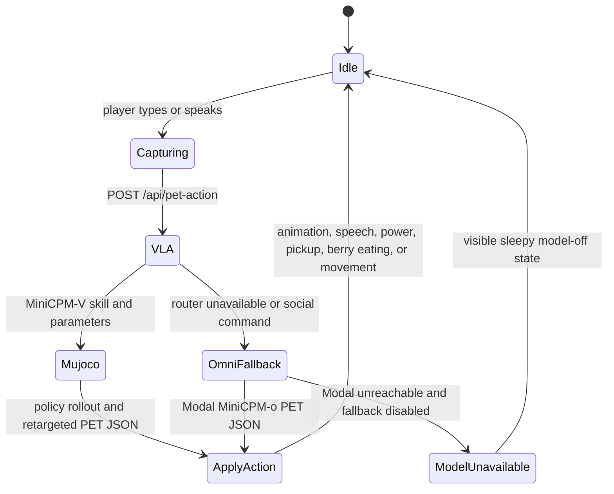

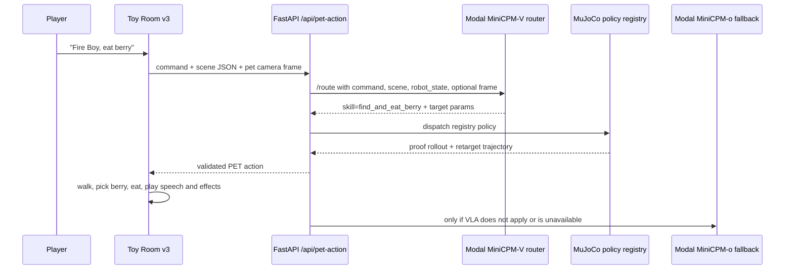

Check Modal remote execution and the deployed MiniCPM apps:

```bash
uv run --with modal modal run scripts/modal_square_smoke.py
modal app list
modal app logs fireboy-vla-router
curl https://YOUR-MODAL-WORKSPACE--fireboy-vla-router.modal.run/health
modal app logs minicpm-omni-45
curl https://YOUR-MODAL-WORKSPACE--minicpm-omni-demo.modal.run/health
```

The Modal MiniCPM-V VLA router is the first Toy Room v3 embodied-action path when `TOYBOX_VLA_ROUTER_ACTION=1`. It maps the command and scene into a skill/parameter contract, then the app dispatches to the MuJoCo policy registry and retargeted Fire Boy motions. The Modal MiniCPM-o app is the fallback/general PET brain: the backend opens `/ws/chat`, sends a compact command/scene/image prompt, reads `prefill_done`, `chunk`, and `done` events, then exposes prompt tokens, completion tokens, Modal event count, latency, and tokens/sec in the Brain Trace panel. Both deployed Modal functions use `scaledown_window=180`, so repeated judging commands within a few minutes should reuse warm workers instead of paying the full cold start every turn.

Measure the current local runtime:

```bash
uv run python scripts/measure_runtime.py --samples 5
```

On macOS, power sampling needs sudo. If you already have a cached sudo session:

```bash
uv run python scripts/measure_runtime.py --samples 5 --power
```

MiniCPM-V 4.6 can be added as the pet's visual cortex. It reads the rendered room camera frame and returns perception plus face blendshape hints, while MiniCPM5 remains the faster action/personality model:

```bash
scripts/start_with_minicpmv46_vision.sh
```

That script uses Ollama models:

- `hf.co/openbmb/MiniCPM5-1B-GGUF:Q4_K_M` for PET-LLM actions
- `minicpm-v4.6` for vision perception

MiniCPM-V 4.6 local vision currently needs Ollama `0.30.0` or newer. The script checks this before pulling the vision model.

Check only the vision endpoint:

```bash
TOYBOX_VISION_ENDPOINT=http://127.0.0.1:11434/api/chat \
TOYBOX_VISION_MODEL=minicpm-v4.6 \
uv run python scripts/check_vision_endpoint.py
```

If no endpoint is configured, the app uses a deterministic fallback policy so the toy remains playable. If an endpoint is configured but cannot be used, the default behavior is visible asleep/model-off mode rather than silently pretending a heuristic is the model.

Action traces are written to `data/traces/pet-actions.jsonl` by default. These become the seed dataset for a later distilled pet-policy model.

## Code Shape

- `src/pet_policy.py` is the small orchestration layer.
- `src/vla_router_policy.py` is the MiniCPM-V 4.6 VLA-first embodied action lane for Toy Room v3.
- `src/modal_omni_policy.py` is the Modal MiniCPM-o WebSocket fallback/general PET lane for Toy Room v3.
- `src/model_policy.py` talks to text/PET-LLM endpoints.
- `src/vision_policy.py` talks to MiniCPM-V-style image endpoints.
- `src/pet_actions.py` validates actions, face blendshapes, powers, and fallback behavior.
- `objectRecipe` in pet actions is the bounded generated-content path for wishable physical toys.
- `src/pet_payload.py` owns scene compaction, target selection, and touch detection.
- `src/pet_payload.py` also detects physical arrangements so model/fallback policies can ground guesses in object positions.
- `frontend/toybox/pet.js` owns character meshes, face drawing, and blendshape interpolation.
- `frontend/toybox/pet_balance.js` owns the hidden weighted standing/balance physics rig.
- `frontend/toybox/senses.js` owns user-view, pet-view, audio, and balance feeds.
- `frontend/toybox/room.js` owns the room shell, physics objects, and history.
- `frontend/toybox/powers.js` owns executable pet powers and target selection.

See `docs/modal-1bit-model-plan.md` for the current Modal, MiniCPM-V, MiniCPM5, and 1-bit policy plan.
