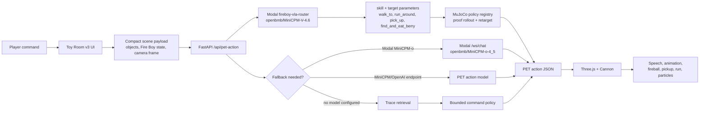
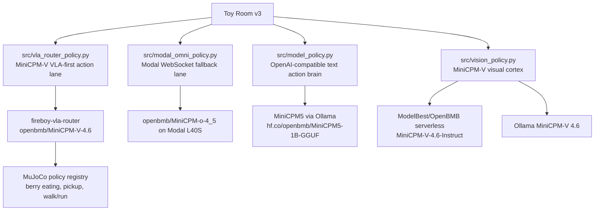

# Prize Qualification Evidence

Toy Room v3 is packaged for the Build Small Hackathon as a tiny-world virtual pet: Fire Boy is a controllable character with a rigged unclothed mesh, babyish speech, physical toy interactions, visible powers, runtime traces, and configurable MiniCPM model backends.

## Public Links

- Hugging Face Space: `https://build-small-hackathon-toy-room-v3.hf.space/toy-v3`
- VLA research page: `https://build-small-hackathon-toy-room-v3.hf.space/vla-research`
- In-depth demo evidence: `https://build-small-hackathon-toy-room-v3.hf.space/fireboy-policy-gallery`
- GitHub repository: `https://github.com/sanjuhs/build-small-hackathon-v1`
- MiniCPM-V VLA model artifacts: `https://huggingface.co/build-small-hackathon/fireboy-minicpm-v-4-6-vla`
- rollout/media artifact dataset: `https://huggingface.co/datasets/build-small-hackathon/fireboy-vla-rollout-artifacts`
- Demo MP4: `demo/fire-boy-v3-demo.mp4`
- Modal MiniCPM-V VLA router: `https://sanjuhs123--fireboy-vla-router.modal.run`
- Modal MiniCPM-o endpoint: `https://sanjuhs123--minicpm-omni-demo.modal.run`

## Prize Map

| Prize | Current evidence |
| --- | --- |
| Best MiniCPM Build | Toy Room v3 uses `openbmb/MiniCPM-V-4.6` through the deployed `fireboy-vla-router` Modal app as the first embodied action lane. `/api/pet-action` calls `run_vla_router_pet_action(payload)` before fallback policies, so berry eating, pickup, walk/go-to, and run-around route through the MiniCPM-V skill/parameter head and MuJoCo policy registry. `openbmb/MiniCPM-o-4_5` remains the Modal fallback/general PET lane for expressive JSON actions. |
| Best Use of Modal | Two Modal apps are used: `fireboy-vla-router` serves the MiniCPM-V 4.6 VLA router and dispatch metadata, while `minicpm-omni-45` serves the MiniCPM-o fallback gateway. Both use GPU-backed Modal deployment, cached model storage, public endpoints, and a 180-second scale-down window for demo reliability. |
| Best Use of Codex | The connected GitHub repo contains Codex-attributed commits by `Codex <codex@openai.com>` for the v3 toy room, Fire Boy command loop, MiniCPM-V action brain, Modal MiniCPM routing, grounded physical actions, screenshots, research artifact, and submission hardening. |
| Best Agent | The backend emits strict PET action JSON. The frontend executes it as character animation, speech, projectile fireballs, object pickup/carry, run routes, particles, physics updates, and loop metrics. |
| Off Brand | The Space is a custom Three.js toy-room UI mounted inside a Gradio-compatible app, not a default chatbot. |
| Best Demo | The MP4 demo shows direct commands, visible actions, speech, metrics, and toy-room controls in roughly 30 seconds. |

## Runtime Truth

Toy Room v3 is configured for the Modal MiniCPM-V router by setting `TOYBOX_VLA_ROUTER_ACTION=1` and `TOYBOX_VLA_ROUTER_URL=https://sanjuhs123--fireboy-vla-router.modal.run`. The runtime panel and `/api/model-status` show the nested `vlaRouter` health, while the top-level MiniCPM-o fields describe the fallback lane.

When model endpoints are configured, the same PET action contract supports:

- Modal MiniCPM-V 4.6 through `src/vla_router_policy.py` and the `fireboy-vla-router` app.
- Modal MiniCPM-o 4.5 fallback/general actions through `src/modal_omni_policy.py`.
- MiniCPM5 through local Ollama or any OpenAI-compatible text endpoint.
- MiniCPM-V 4.6 through an OpenAI-compatible vision endpoint such as ModelBest/OpenBMB serverless.
- RunPod/Hugging Face/OpenAI-compatible hosted routes.

## Architecture



## MiniCPM Paths



## Modal Evidence

The MiniCPM-V VLA Modal app uses:

- App name: `fireboy-vla-router`
- Model: `openbmb/MiniCPM-V-4.6`
- Policy artifact: `minicpm_vla_skill_param_head.pt`
- Dispatch: `walk_to`, `run_around`, `pick_up`, and `find_and_eat_berry`
- Public endpoint: `https://sanjuhs123--fireboy-vla-router.modal.run`

The MiniCPM-o fallback Modal app uses:

- App name: `minicpm-omni-45`
- Model: `openbmb/MiniCPM-o-4_5`
- GPU: `L40S`
- Volume: `minicpm-omni-cache`
- Secret: `huggingface-token`
- Public endpoint: `https://sanjuhs123--minicpm-omni-demo.modal.run`

Validation commands:

```bash
modal app list
modal container list --json
modal app logs fireboy-vla-router
curl https://sanjuhs123--fireboy-vla-router.modal.run/health
modal app logs minicpm-omni-45
curl https://sanjuhs123--minicpm-omni-demo.modal.run/health
```

The Modal path is a real runtime component for Toy Room v3. Verified Space API commands route through the VLA router:

- `eat berry` returns `debug.policy=modal_minicpm_vla_router_plus_mujoco`, `debug.vlaRouter.modelId=openbmb/MiniCPM-V-4.6`, `skill=find_and_eat_berry`, and a MuJoCo result with `grasped=true`, `eaten=true`.
- `pick up the ball` returns `skill=pick_up`, `dispatch=registry:pick_up`, and a MuJoCo result with `grasped=true`.

## OpenAI Codex Evidence

The Git history has a visible chain of commits authored by `Codex <codex@openai.com>`, including:

- `45e75e8 feat: ship Fire Boy toy room v3`
- `5ba01e4 feat: wire MiniCPM-V action brain`
- `b7a60af feat: route toy v3 brain through Modal MiniCPM`
- `1833553 fix: harden Modal websocket timeouts`
- `474616f fix: keep MiniCPM-V toy loop live`
- `5e9cd86 fix: make Fire Boy locomotion and pickup physical`
- `9a2319f fix: ground Fire Boy pickup targets`
- `093936f fix: add grounded Fire Boy gestures`

The newer `/vla-research` page and generated PDF further explain how OpenAI Codex was used holistically: scaffolding routes and pages, generating/organizing evidence, debugging Modal and VLA action contracts, polishing screenshots, and packaging the research narrative.

## MiniCPM / Modal Checklist

- MiniCPM-V qualifies because `openbmb/MiniCPM-V-4.6` is the live VLA-first embodied route for Toy Room v3 and is used in the frozen-backbone skill/parameter head.
- MiniCPM-o qualifies as an additional MiniCPM-family fallback because `openbmb/MiniCPM-o-4_5` is available through the Modal `/ws/chat` gateway for general PET JSON actions.
- Modal qualifies because the runtime uses deployed Modal apps, GPU execution, cached model storage, Modal Secrets, public gateways, and Toy Room v3 calls Modal during judge-facing commands.
- Nemotron is not claimed because the runtime does not use Nemotron models.

## Security Hygiene

- `.env`, nested `.env` files, `.claude/`, logs, traces, model caches, and virtual environments are ignored.
- `.env.example` files are tracked for setup only.
- Hugging Face and Modal credentials belong in Hugging Face Space secrets or Modal Secrets, not in the repository.
- The current tracked file list includes `.env.example` files only; the real local Modal frontend `.env` is ignored.
