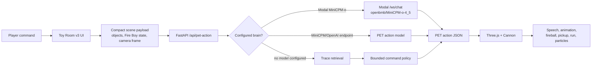
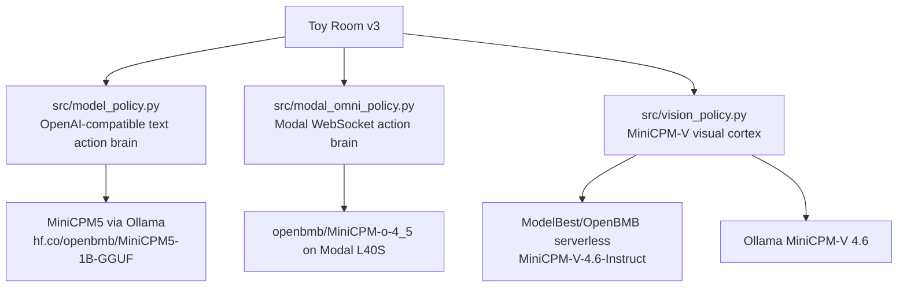

# Prize Qualification Evidence

Toy Room v3 is packaged for the Build Small Hackathon as a tiny-world virtual pet: Fire Boy is a controllable character with a rigged unclothed mesh, babyish speech, physical toy interactions, visible powers, runtime traces, and configurable MiniCPM model backends.

## Public Links

- Hugging Face Space: `https://build-small-hackathon-toy-room-v3.hf.space/toy-v3`
- GitHub repository: `https://github.com/sanjuhs/build-small-hackathon-v1`
- Demo MP4: `demo/fire-boy-v3-demo.mp4`
- Modal MiniCPM-o endpoint: `https://sanjuhs123--minicpm-omni-demo.modal.run`

## Prize Map

| Prize | Current evidence |
| --- | --- |
| Best MiniCPM Build | Toy Room v3 calls `openbmb/MiniCPM-o-4_5` through the deployed Modal `/ws/chat` gateway in `src/modal_omni_policy.py`; `src/vision_policy.py`, `minicpm-v-serverless/`, and MiniCPM5/Ollama remain documented secondary MiniCPM routes. |
| Best Use of Modal | `modal-minicpm-omni/modal_minicpm_omni.py` builds the official MiniCPM-o demo into a Modal image, caches model weights in `minicpm-omni-cache`, loads them on an L40S GPU, and serves the web gateway through Modal. Toy Room v3 uses that live Modal gateway as its primary action brain. |
| Best Use of Codex | The repository history contains Codex-attributed commits for the v3 toy room, Fire Boy command loop, MiniCPM-V helper, docs, and submission hardening. |
| Best Agent | The backend emits strict PET action JSON. The frontend executes it as character animation, speech, projectile fireballs, object pickup/carry, run routes, particles, physics updates, and loop metrics. |
| Off Brand | The Space is a custom Three.js toy-room UI mounted inside a Gradio-compatible app, not a default chatbot. |
| Best Demo | The MP4 demo shows direct commands, visible actions, speech, metrics, and toy-room controls in roughly 30 seconds. |

## Runtime Truth

Toy Room v3 is configured for Modal MiniCPM-o by setting `TOYBOX_MODAL_OMNI_ACTION=1` and `TOYBOX_MODAL_OMNI_URL=https://sanjuhs123--minicpm-omni-demo.modal.run`. The runtime panel and `/api/model-status` make the active model path visible instead of pretending a hosted model is active.

When model endpoints are configured, the same PET action contract supports:

- Modal MiniCPM-o 4.5 through `src/modal_omni_policy.py`.
- MiniCPM5 through local Ollama or any OpenAI-compatible text endpoint.
- MiniCPM-V 4.6 through an OpenAI-compatible vision endpoint such as ModelBest/OpenBMB serverless.
- RunPod/Hugging Face/OpenAI-compatible hosted routes.

## Architecture



## MiniCPM Paths



## Modal Evidence

The Modal app uses:

- App name: `minicpm-omni-45`
- Model: `openbmb/MiniCPM-o-4_5`
- GPU: `L40S`
- Volume: `minicpm-omni-cache`
- Secret: `huggingface-token`
- Public endpoint: `https://sanjuhs123--minicpm-omni-demo.modal.run`

Validation commands:

```bash
modal app list
modal container list --json
modal app logs minicpm-omni-45
curl https://sanjuhs123--minicpm-omni-demo.modal.run/health
```

The Modal path is a real runtime component for Toy Room v3. Verified local UI command metrics for "walk around": one `/api/pet-action` call, one Modal `/ws/chat` turn, `promptTokens: 1638`, `completionTokens: 9`, `tokensPerSecond: 2.35`, and `clientRoundTripMs: 3880.4`.

## Security Hygiene

- `.env`, nested `.env` files, `.claude/`, logs, traces, model caches, and virtual environments are ignored.
- `.env.example` files are tracked for setup only.
- Hugging Face and Modal credentials belong in Hugging Face Space secrets or Modal Secrets, not in the repository.
- The current tracked file list includes `.env.example` files only; the real local Modal frontend `.env` is ignored.
