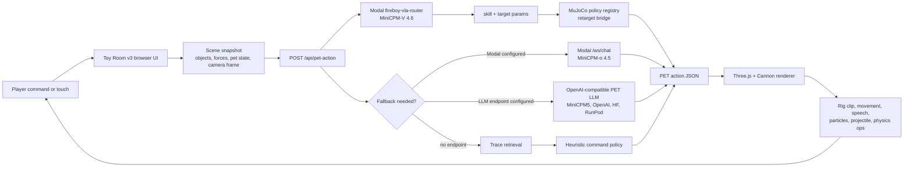
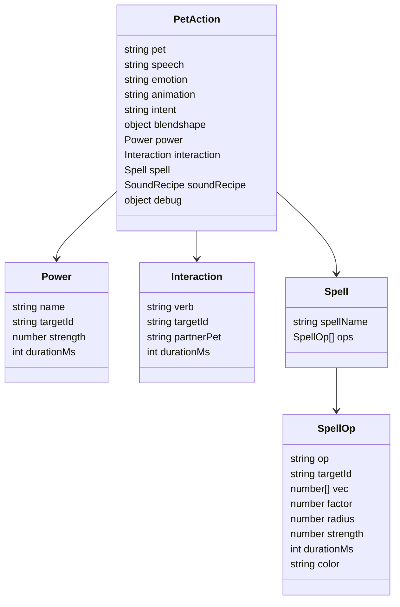
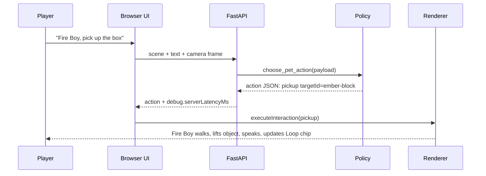
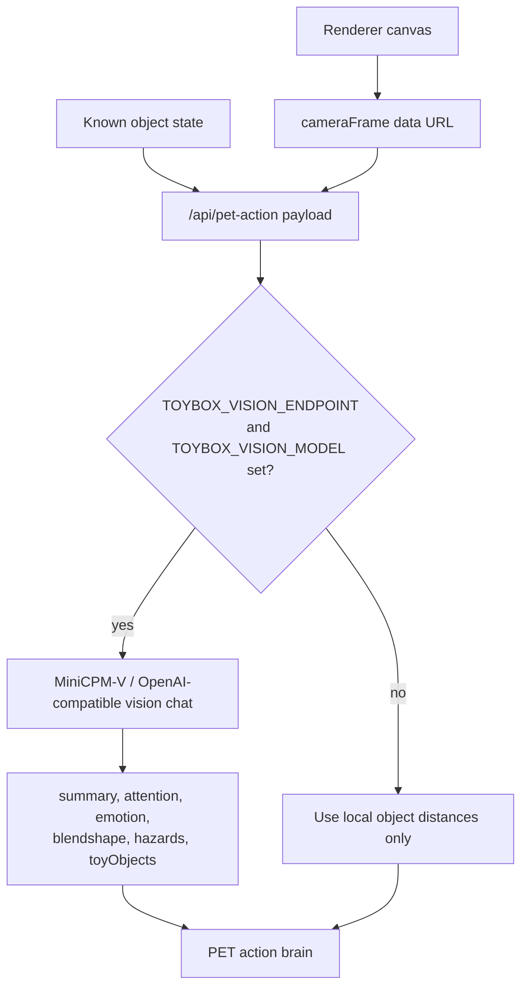
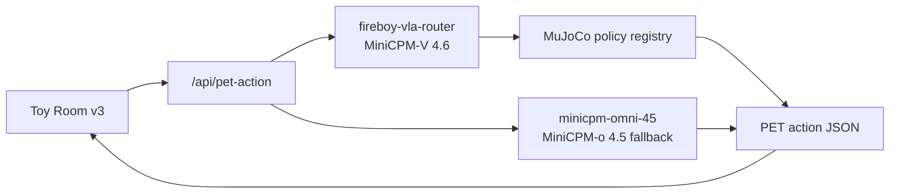
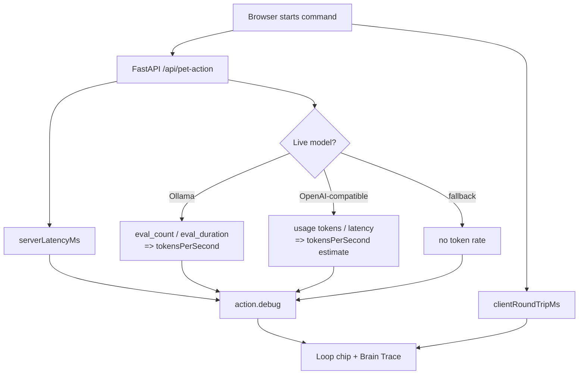
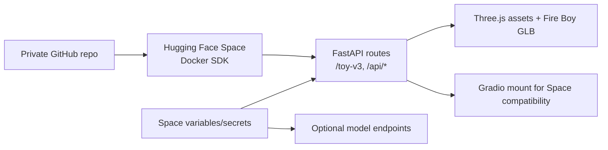
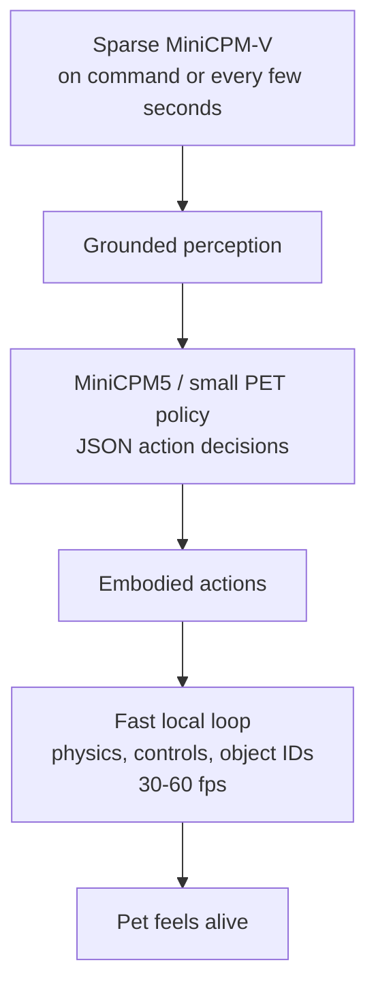

# Toy Room V3 Architecture

Toy Room v3 is the small, shippable cut of Tiny Toybox: one controllable Fire Boy in a toy room. The product target is closer to Talking Tom or a tiny Pokemon companion than a generic chat app. The user talks to the character, Fire Boy answers in a babyish voice, and the renderer turns each action decision into animation, speech, particles, physics, and toy-object state changes.

## Current Runtime Truth

As of this build, Toy Room v3 is wired to a MiniCPM-V-first embodied action route:

- `/api/model-status` includes a nested `vlaRouter` object for `https://sanjuhs123--fireboy-vla-router.modal.run`; that route uses `openbmb/MiniCPM-V-4.6`.
- The top-level Modal/MiniCPM-o status describes the fallback/general PET lane, not the first embodied VLA path.
- Toy Room v3 sends one `/api/pet-action` request per typed/spoken command or explicit quick button.
- `app.py` intentionally evaluates `run_vla_router_pet_action(payload) or run_mujoco_pet_action(payload) or choose_pet_action(payload)`.
- `src/vla_router_policy.py` sends command, scene, robot state, and optional camera frame to the Modal MiniCPM-V router. The router returns a skill/parameter contract, and the backend dispatches it through the MuJoCo policy registry.
- `src/modal_omni_policy.py` opens one Modal `/ws/chat` turn only for fallback/general PET commands, sends compact scene JSON plus optional camera frame, and validates streamed MiniCPM-o JSON into the same PET action contract.
- v3 does not run page-load greetings or ambient autoplay model calls; it waits for direct player commands.

Verified Space API commands:

- `eat berry` routes to `openbmb/MiniCPM-V-4.6`, `skill=find_and_eat_berry`, `dispatch=registry:find_and_eat_berry`, and returns a MuJoCo policy proof with `grasped=true` and `eaten=true`.
- `pick up the ball` routes to `skill=pick_up`, `dispatch=registry:pick_up`, and returns a MuJoCo policy proof with `grasped=true`.

## Product Loop



The important design choice is that every model path must emit the same PET action JSON. That keeps the renderer deterministic and testable even when the model backend changes.

## Action JSON Contract

A single action response contains:

- `speech`: the short line Fire Boy says.
- `emotion` and `blendshape`: face/body expression controls.
- `animation`: high-level animation hint.
- `power`: named ability such as `fireball`, `ember_jump`, or `smoke_poof`.
- `interaction`: physical command such as `pickup`, `carry`, `bring`, `run`, `read`, `eat`, `sit`, or `recycle`.
- `spell.ops`: low-level renderer operations such as `impulse`, `spawn_particle`, `set_light`, `nudge_pet`, `scale`, and `attract`.
- `sound` and `soundRecipe`: WebAudio/baby voice output.
- `objectRecipe`: optional generated toy recipe.
- `debug`: policy source and timing evidence.



## Fire Boy Commands

V3 now has first-class command handling for the key hackathon demo actions:

- "pick up the box" -> `interaction.verb = pickup`, Fire Boy moves near a toy, lifts it, and shows particles.
- "carry/fetch/bring the box" -> `interaction.verb = carry` or `bring`, Fire Boy lifts and relocates the toy.
- "fireball the cube" -> `power.name = fireball`, Fire Boy plays a throw clip and launches a visible warm projectile.
- "run around" -> `interaction.verb = run`, Fire Boy follows a short route around the room and leaves ember particles.



## Vision Path

There are two levels of "vision" in this project.

1. Browser-local object detection: the Three.js scene already knows object positions, IDs, affordances, distances, and velocity. This is fast and used every frame for the perception panel.
2. Optional MiniCPM-V visual cortex: when configured, the browser sends a rendered camera frame to the backend, and `src/vision_policy.py` asks a vision model for compact perception JSON and blendshape hints.



The MiniCPM-V hook expects an OpenAI-compatible Chat Completions endpoint:

```bash
TOYBOX_VISION_ENDPOINT=https://api.modelbest.cn/v1/chat/completions
TOYBOX_VISION_MODEL=MiniCPM-V-4.6-Instruct
TOYBOX_VISION_API_KEY=...
```

For local Ollama-style vision, the endpoint can be:

```bash
TOYBOX_VISION_ENDPOINT=http://127.0.0.1:11434/api/chat
TOYBOX_VISION_MODEL=minicpm-v4.6
```

The current server is not configured with either path, so the runtime chip correctly says `Vision: camera frame`, not `MiniCPM-V`.

## Modal Status

Toy Room v3 uses two Modal apps:

- `fireboy-vla-router` serves the live MiniCPM-V 4.6 VLA route. It loads `openbmb/MiniCPM-V-4.6`, uses the trained skill/parameter head, returns `walk_to`, `run_around`, `pick_up`, or `find_and_eat_berry`, and dispatches into MuJoCo policy proofs.
- `minicpm-omni-45` serves the MiniCPM-o 4.5 fallback/general PET route. It wraps the official MiniCPM-o demo stack and adapts `/ws/chat` output into the same PET action JSON schema.

Both are real Modal runtime components for the submission:

- The public VLA endpoint is `https://sanjuhs123--fireboy-vla-router.modal.run`.
- The public MiniCPM-o endpoint is `https://sanjuhs123--minicpm-omni-demo.modal.run`.
- Both workers use GPU-backed Modal deployments and 180-second scale-down windows for judge-facing reliability.



## Timing And Function Calls

The app records timing in two places:

- FastAPI adds `debug.serverLatencyMs`.
- The browser adds `debug.clientRoundTripMs` and increments `document.body.dataset.actionSequence`.

The runtime panel exposes:

- `Loop`: browser round-trip plus estimated state ops, for example `218ms / 8 ops`.
- `lastStateChanges`: estimated changes applied by the renderer.
- `lastFunctionCalls`: approximate renderer function calls used to update state.
- `lastTokenRate`: tokens/sec when a model backend reports token stats.

Current measured local fallback performance:

- `/api/pet-action` median latency: about `322.5 ms` across 5 local samples after the latest restart.
- Mean latency: about `330.5 ms`.
- No live token/sec number is available because the local run is not using an LLM endpoint.
- `ollama ps` shows no model loaded.

When Ollama is enabled, `src/model_policy.py` reads `eval_count` and `eval_duration` from the Ollama response and reports `tokensPerSecond`.



## Hosting Shape

Toy Room v3 is Docker-ready for Hugging Face Spaces. The Space should run `app.py` on port `7860`.



Recommended Space variables:

```bash
TOYBOX_TRACE_POLICY=1
TOYBOX_ALLOW_HEURISTIC_FALLBACK=1
```

Optional hosted model variables:

```bash
TOYBOX_LLM_ENDPOINT=https://router.huggingface.co/v1/chat/completions
TOYBOX_LLM_MODEL=<provider-model-id>
TOYBOX_LLM_API_KEY=<secret>

TOYBOX_VISION_ENDPOINT=https://api.modelbest.cn/v1/chat/completions
TOYBOX_VISION_MODEL=MiniCPM-V-4.6-Instruct
TOYBOX_VISION_API_KEY=<secret>
```

## Why MiniCPM-V Is A Good Fit

The product does not need a huge model on every frame. It needs a small visual cortex that occasionally answers questions such as:

- What object is closest to Fire Boy?
- Is something in front of him?
- What should his face look like after seeing the room?
- Are there hazards or special objects?

MiniCPM-V 4.6 is attractive because it is small enough to be plausible for this "tiny world" story while still supporting image understanding. The better architecture is sparse vision plus frequent lightweight action decisions:



## What To Demo

The strongest demo path:

1. Open `/toy-v3`.
2. Say: "Fire Boy, pick up the box."
3. Say: "Fire Boy, fireball the cube."
4. Say: "Fire Boy, run around the toy room."
5. Point out the runtime chips: Brain, Loop, Vision, Audio, Train, Rigs.
6. Mention that live MiniCPM-V is optional and the status chip is honest about whether it is connected.

The product promise is now visible: Fire Boy is not just replying with text. The command changes the toy room.
