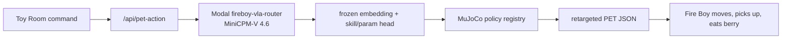

# Fire Boy MiniCPM-V 4.6 VLA Router Artifacts

This repository backs the Toy Room v3 embodied-action demo:

- Space: https://build-small-hackathon-toy-room-v3.hf.space/toy-v3
- VLA research page: https://build-small-hackathon-toy-room-v3.hf.space/vla-research
- Policy gallery: https://build-small-hackathon-toy-room-v3.hf.space/fireboy-policy-gallery
- Dataset/artifacts: https://huggingface.co/datasets/build-small-hackathon/fireboy-vla-rollout-artifacts

The shipped live route uses MiniCPM-V 4.6 as the vision-language backbone, freezes the backbone, mean-pools the 1024-d vision-language representation, and trains a small skill/parameter head. The router emits a bounded contract:

- `walk_to`
- `run_around`
- `pick_up`
- `find_and_eat_berry`

Toy Room v3 calls this route first through `src/vla_router_policy.py`, then dispatches the selected skill into the MuJoCo policy registry and retargets the proof rollout into visible Fire Boy movement.

## What Is Included

- `checkpoints/`: trained VLA heads, LoRA/action-head experiments, eval JSON, summaries, and embedding caches.
- `runtime-policies/`: small MuJoCo policy artifacts needed by the Toy Room v3 runtime.
- `docs/`: research notes copied from the source project.

The final judge-facing router currently loads:

```text
checkpoints/fireboy_minicpm_vla_skill_param_head/minicpm_vla_skill_param_head.pt
```

and dispatches against the skill-parameter rows in:

```text
checkpoints/fireboy_minicpm_vla_skill_param_head/fireboy_vla_skill_params_allskill.jsonl
```

## Runtime Mapping



## License

The adapter heads, exported policy artifacts, cards, docs, and generated evidence in this repository are released under the MIT license. The upstream MiniCPM-V base model is not redistributed here and remains governed by its own upstream license and model card.
